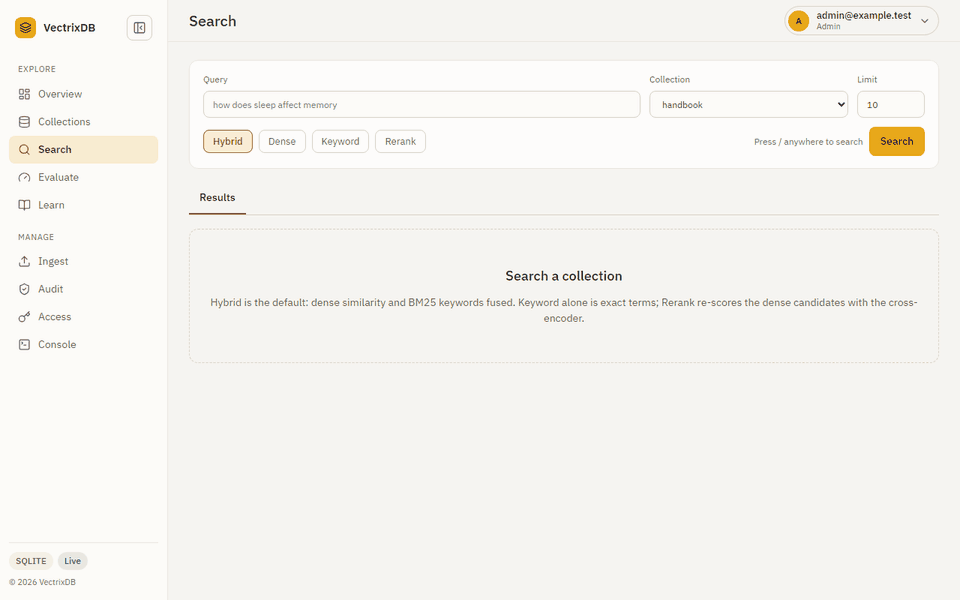
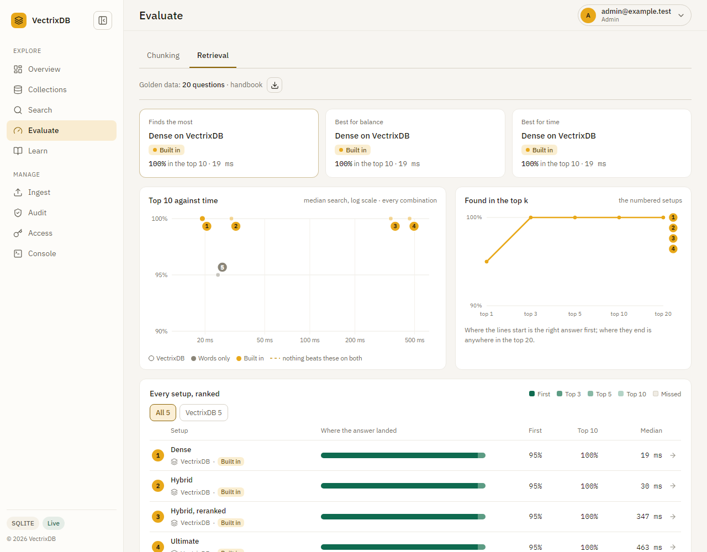
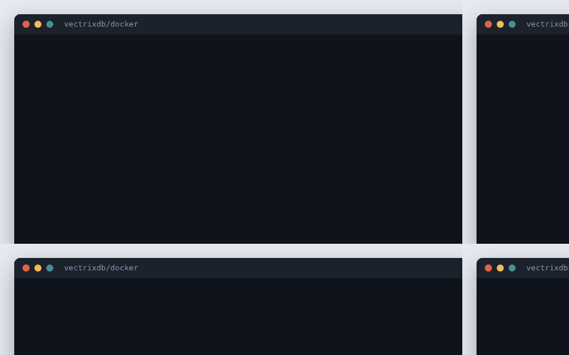
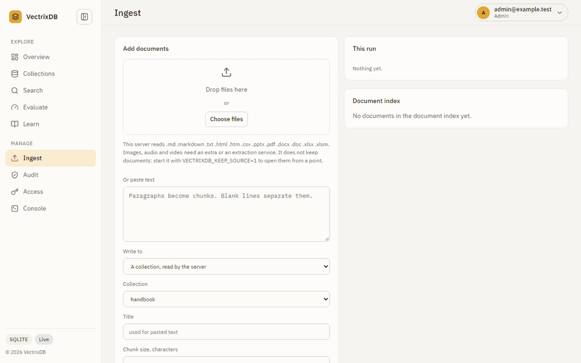

<div align="center">

# VectrixDB

**The vector database that works with no network and no accounts.**

Embedded ONNX models, GraphRAG, and eight storage backends.
Nothing to sign up for, no API key, no service to run.

[](https://opensource.org/licenses/Apache-2.0)
[](https://pypi.org/project/vectrixdb/)
[](https://pypi.org/project/vectrixdb/)
[](https://pepy.tech/project/vectrixdb)
[](https://github.com/knowusuboaky/VectrixDB/issues)

[Changelog](CHANGELOG.md) &middot;
[Contributing](CONTRIBUTING.md) &middot;
[Security](SECURITY.md) &middot;
[Handle errors](docs/how-to/handle-errors.md)

</div>

<p align="center">
  
  <br><sub>A question goes in, and every result says how well it matched and what found it: meaning, keywords, or both.</sub>
</p>

---

## Install

```bash
pip install vectrixdb
```

Five dependencies. That is the whole library: vector search, with the embedding
model inside the package. No web server, no cloud SDKs, no account.

## Quick start

```python
from vectrixdb import Vectrix

db = Vectrix("my_docs")
db.add(["Python is great", "JavaScript powers the web", "Rust is fast"])

results = db.search("programming")
print(results.top.text)
```

There is no configuration step. The embedding model ships with the package, so
the first search works offline on a machine that has never seen an API key.

Give it a path and it persists:

```python
db = Vectrix("my_docs", path="./data")
```

The default backend is SQLite in WAL mode, so committed writes survive an abrupt
shutdown and several threads can read and write at once.

## The server and its dashboard

`pip install "vectrixdb[api]"` and `vectrixdb serve` give the same collections
a REST API and a dashboard: health and text, search with a relevance on every
result, the evaluation runs that pick a setup, and with `vectrixdb[signin]`
people who sign in as themselves, roles, masking, and a record of who read
what. [Use the dashboard](docs/how-to/dashboard.md) walks every page.

<p align="center">
  
  <br><sub>The run in this picture is sample data, drawn to show the page, not a measurement. <code>vectrixdb evaluate</code> on your own questions gives real numbers.</sub>
</p>

## Run it in containers

Each release publishes signed images of the server and the extraction service,
for Intel and ARM. `docker/compose.yaml` runs the two on one machine, with
Jaeger beside them to see each search and upload as a trace, and
`docker/kubernetes` runs them on a cluster.
[Run it in containers](docs/how-to/containers.md) has the steps, and how to
check a signature before anything runs.

<p align="center">
  
</p>

## Documentation

Grouped by what you came for: learning it, doing one thing, looking something
up, or understanding why it works that way. They render at
[knowusuboaky.github.io/VectrixDB](https://knowusuboaky.github.io/VectrixDB/).
Their examples are executed by the test suite, apart from the few that need an
optional package or a cloud account, so the code on them cannot quietly rot.

**Tutorial**

- [Getting started](docs/tutorial/getting-started.md), from an empty directory
  to a working search in one sitting
- [Add it with your coding agent](docs/how-to/coding-agents.md), a prompt to
  paste into Claude Code, Cursor or Copilot, and
  [llms.txt](https://knowusuboaky.github.io/VectrixDB/llms.txt), the docs index
  agents read

**How-to guides**

- [Handle errors](docs/how-to/handle-errors.md)
- [Choose a storage backend](docs/how-to/storage-backends.md)
- [Run the REST API](docs/how-to/rest-api.md)
- [Build an app on it](docs/how-to/build-an-app.md), in any language, on
  somebody else's server
- [Sign people in](docs/how-to/sign-in.md)
- [Put your company's name on it](docs/how-to/branding.md)
- [Deploy the server](docs/how-to/deploy.md)
- [Run it in containers](docs/how-to/containers.md), signed images for one
  machine or Kubernetes
- [Put it behind a gateway](docs/how-to/behind-a-gateway.md), APIM, API Gateway
  or any proxy
- [Tips and tricks](docs/how-to/tips.md), the things that are easy to miss
- [Use the dashboard](docs/how-to/dashboard.md), every page, with pictures
- [Restrict what a search can see](docs/how-to/entitlements.md)
- [Trace an answer to its source](docs/how-to/lineage.md)
- [Keep conversation memory](docs/how-to/conversation-memory.md)
- [Use it from an assistant over MCP](docs/how-to/mcp-server.md)
- [Trace searches and ingestion](docs/how-to/tracing.md), opt-in OpenTelemetry
  spans that never carry query or document text
- [Run without a network](docs/how-to/offline.md)
- [Back up, move and restore](docs/how-to/export-import.md)
- [Ingest documents](docs/how-to/ingest-documents.md)
- [Extract, keep, index](docs/how-to/extract-keep-index.md)
- [Ingest when a file lands](docs/how-to/ingest-on-event.md)
- [Keep a collection in step with feeds and pages](docs/how-to/sources.md)
- [Run an extraction service](docs/how-to/extraction-service.md)
- [Measure retrieval](docs/how-to/measure-retrieval.md)
- [Evaluate every setup](docs/how-to/evaluate-setups.md)
- [LangChain, LlamaIndex, plugins, CLI](docs/how-to/integrations.md)
- [Work with the knowledge graph](docs/how-to/knowledge-graph.md)

**Reference**

- [Easy API](docs/reference/easy.md), the `Vectrix` surface
- [Exceptions](docs/reference/exceptions.md), the full hierarchy
- [Filters](docs/reference/filters.md), every operator and what it does to
  absent fields, nulls and lists
- [Command line](docs/reference/cli.md), every command and option
- [Settings](docs/reference/settings.md), every environment variable the
  server reads
- [REST API](docs/reference/rest-api.md), every route and who may call it
- [Errors](docs/reference/errors.md), every refusal a route can send and every
  exception the library raises, read off the code
- [OpenAPI document](docs/reference/openapi.json), the same route table for a
  gateway to import

**Explanation**

- [Why VectrixDB](docs/explanation/why-vectrixdb.md)
- [What it does not do](docs/explanation/limits.md), the limits in one place
- [Benchmarks](docs/explanation/benchmarks.md)
- [Search modes](docs/explanation/search-modes.md)
- [Score and relevance](docs/explanation/relevance.md)
- [HNSW and its limits](docs/explanation/hnsw.md)
- [Threads and processes](docs/explanation/concurrency.md)
- [Memory per vector](docs/explanation/memory.md)
- [Writing past RAM](docs/explanation/larger-than-ram.md)

## Errors

Everything VectrixDB raises derives from `VectrixError`, so one `except` covers
the library:

```python
from vectrixdb import VectrixError

try:
    results = db.search("programming")
except VectrixError as exc:
    log.warning("search unavailable: %s", exc)
```

A document that does not exist comes back as an empty result, not an
exception: `get()` takes one id or many and always returns a list, so a miss
is `[]`. A backend you cannot reach raises. Those stay distinguishable, so an
empty result always means "nothing matched" rather than "something broke".
See [Handle errors](docs/how-to/handle-errors.md) for the full hierarchy.

---

## The dashboard is optional

> [!NOTE]
> **You do not need any of this to use VectrixDB.** The library is complete on
> its own, and `pip install vectrixdb` deliberately does not install a web
> server. The dashboard and REST API live behind an extra:
>
> ```bash
> pip install vectrixdb[api]
> vectrixdb serve
> ```
>
> Then open <http://127.0.0.1:7337/dashboard/>. If you only ever call VectrixDB
> from Python, skip this section entirely.

### What is on it

Eight pages, one server, no build step. Every number on them is read from the
running database and the page says so when it cannot read one.

- **Overview.** Collections, vectors, size on disk and search latency, and a
  *needs attention* list: a collection past 20% deleted vectors, a collection
  whose model is not on this machine. On a fresh server it is a first-run page
  with a working demo loader.
- **Collections.** Cards with a state pill, mode, language, model, tags and
  the current build id, filterable by state and mode. A collection opens with
  tabs: Overview, Points, Policy, Builds, Quality and Settings. A collection
  that carries an entitlement policy shows its rules and fingerprint and
  nothing that moves with its contents, because this API resolves no
  principals; each tab says so and shows the Python that does.
- **Search.** Hybrid by default, then dense, keyword and rerank, with the
  server time and round trip, per-result score parts where the mode reports
  them, and a graph tab for collections with entities. The previous page
  offered Rerank and Late interaction modes that the server ignored, so both
  ran plain dense search; Rerank is real now and Late interaction is gone
  until there is a text route for it.
- **Ingest.** Files or pasted text into a collection as chunks, or into the
  document index, with metadata on every chunk. A plain splitter, on purpose:
  loaders, the four chunkers, parent sections, deduplication, the quality score
  and the metadata contract live in `add_document()`.
- **Audit.** The decision and ingestion records from a JSONL sink, served only
  from a server with an API key and only with that key, and never with the
  principal snapshot, the result ids or the undisclosable count.
- **Console.** A request builder with presets that shows the curl for what it
  sent.
- **Learn.** The tutorials and the copy-paste guide.
- **Settings.** Every model the library knows and whether it is on this
  machine, the server's facts, the API key, and the theme.

<p align="center">
  
  <br><sub>A PDF goes in, the server reads it, and says what it found: two pages, two chunks, and the citation each one carries.</sub>
</p>

The badge in the sidebar reports what the server reports: *Open, no key set*
on a local server, *Read only* or *Authenticated* on one with a key. The
previous page said *Read Only* on every server and refused to load the demo
without a key the server did not have.

---

## Install what you need

The core install stays small on purpose. Everything past vector search is an
extra, so you never pay for a subsystem you do not use.

```bash
pip install vectrixdb              # the library, five dependencies

pip install vectrixdb[api]         # REST API server and dashboard
pip install vectrixdb[aws]         # OpenSearch, Aurora PostgreSQL
pip install vectrixdb[azure]       # Cosmos DB
pip install vectrixdb[databricks]  # Lakebase, Delta Lake
pip install vectrixdb[postgres]    # PostgreSQL
pip install vectrixdb[hf]          # HuggingFace sentence-transformers
pip install vectrixdb[fastembed]   # FastEmbed
pip install vectrixdb[viz]         # UMAP visualisation
pip install vectrixdb[mcp]         # MCP server for agent memory
pip install vectrixdb[nlp]         # spaCy, for better GraphRAG extraction

pip install vectrixdb[all]         # every backend and model extra above,
                                   # mcp included; not nlp, which is separate
```

From source, or a specific version:

```bash
pip install git+https://github.com/knowusuboaky/VectrixDB.git
pip install git+https://github.com/knowusuboaky/VectrixDB.git@v2.2.0
```

[uv](https://docs.astral.sh/uv/) works everywhere pip does here, including the
extras: `uv add vectrixdb`, or `uv pip install "vectrixdb[api]"`. The package
is a standard PEP 517 build with no pip-specific steps, so nothing about the
install path is special.

## Benchmarks

Same vectors, same machine, one thread, each library at its defaults. Reproduce with `python scripts/benchmark_compare.py --size 10000 --queries 200`; the [benchmarks page](https://knowusuboaky.github.io/VectrixDB/explanation/benchmarks/) has the chart, the BEIR retrieval-quality numbers and the caveats in full.

| Engine | ingest 10,000 | recall@10 | p50 | p95 | QPS |
| --- | ---: | ---: | ---: | ---: | ---: |
| VectrixDB | 1.7 s | 0.998 | 0.88 ms | 1.16 ms | 1,091 |
| Chroma | 2.2 s | 1.000 | 1.90 ms | 2.34 ms | 510 |
| LanceDB | 4.0 s | 0.802 | 7.24 ms | 8.83 ms | 135 |
| Qdrant (local mode) | 32.6 s | 1.000 | 16.87 ms | 21.36 ms | 57 |

Measured on 19 September 2026 on an Intel x86-64 CPU with 8 threads, Windows 11, Python 3.13. Milliseconds are the machine's; the order and the gaps are what carry over.

Two things the table hides. Qdrant's local mode is exhaustive search, not the server's HNSW, so its recall is 1.0 by construction; and LanceDB's default index is IVF_PQ, which trades recall for memory and can be tuned up. Embedding dominates real ingest for every engine and is not in this table.

### How it compares, honestly

| | VectrixDB | Chroma | LanceDB | Qdrant |
| --- | --- | --- | --- | --- |
| Embedding model in the package, offline | yes | no, downloads on first use | no | no |
| Hybrid search with BM25 | yes | Chroma Cloud only | yes, its own full-text index | yes, sparse vectors fused by RRF; the BM25 model is a download |
| Cross-encoder reranker bundled | yes | no | no | no |
| Late interaction (ColBERT) | yes, model in the package | no | yes, multivector columns; bring the model | yes, multivectors with MaxSim; bring the model |
| Knowledge graph and GraphRAG | yes | no | no | no |
| Conversation memory with token budgets | yes | no | no | no |
| Metadata filters | yes | yes | yes | yes |
| Columnar storage, Arrow, versioned tables | no | no | yes | no |
| Runs as a server for many clients | one team, one process: sign-in, roles, an access log | yes | cloud | yes |
| Sharding and replication | no | no | cloud | yes |
| GPU embedding | bundled models run on the CPU; via your own model | via your own model | via your own model | via your own model |
| Billions of vectors | no | no | yes, on disk | yes, clustered |

Checked against chromadb 1.5.9, lancedb 0.38.0 and qdrant-client 1.19.0, each embedded in a Python process as the benchmark runs them: Chroma refuses a sparse index outside its cloud, and LanceDB and Qdrant's local mode both search multivectors. VectrixDB is the one to pick when the search has to live inside a Python process and work with nothing else running. It is the wrong pick for a fleet of machines, a GPU embedding pipeline, or a corpus that does not fit one box.

## What is in the box

| | |
|---|---|
| **Search modes** | Dense, hybrid, ultimate (reranked), graph (GraphRAG) |
| **Storage** | Memory, SQLite, Lakebase, Delta Lake, Cosmos DB, Azure AI Search, OpenSearch, Aurora PostgreSQL |
| **Models** | Bundled ONNX for offline use, or bring your own from HuggingFace |
| **Memory** | Conversation turns, pinned facts, recency and feedback weighting |
| **Extras** | Document index with chunking, REST API, dashboard, CLI, MCP server |
| **Typing** | Ships `py.typed`, so your type checker sees the annotations |

---

## Search Modes

VectrixDB offers 4 search modes, each building on the previous:

| Mode | Components | Best For |
|------|------------|----------|
| `dense` | Vector similarity | Fast semantic search |
| `hybrid` | Dense + Sparse + Reranker | Keyword + semantic matching |
| `ultimate` | Hybrid + ColBERT | Maximum accuracy |
| `graph` | Ultimate + Knowledge Graph | Complex reasoning (GraphRAG) |

```python
# Choose your mode
db = Vectrix("docs", mode="dense")     # Fastest
db = Vectrix("docs", mode="hybrid")    # Balanced
db = Vectrix("docs", mode="ultimate")  # Best quality
db = Vectrix("docs", mode="graph")     # GraphRAG
```

---

## Model Selection

Customize models for each component. Models load from 3 sources:

### 1. Bundled Models (Offline, No Downloads)

Pre-packaged ONNX models that work without internet. Three of them, 33 MiB each, plus the BM25 vocabulary: about 100 MiB unpacked. They compress to most of a 68.6 MiB wheel, against PyPI's 100 MiB limit, measured by `python scripts/check_wheel_size.py`. Sizes here are mebibytes, the same unit PyPI measures that limit in; a file manager counting in megabytes shows the wheel as 72 MB.

```python
db = Vectrix(
    "docs",
    mode="ultimate",
    dense_model="bge-small",           # 384 dim, 33MB, the default
    sparse_model="bm25",               # 1MB
    reranker_model="L12",              # 33MB
    late_interaction_model="colbert",  # 33MB
)
```

| Component | Alias | Model | Dimension | Size |
|-----------|-------|-------|-----------|------|
| Dense | `bge-small` (default) | BAAI/bge-small-en-v1.5 | 384 | 33MB |
| Sparse | `bm25` | BM25 vocabulary | - | 1MB |
| Reranker | `L12` | ms-marco-MiniLM-L-12-v2 | - | 33MB |
| ColBERT | `colbert` | answerai-colbert-small-v1 | 128 | 33MB |

`e5-small` (intfloat/e5-small-v2, the default before 2.2) is not in the wheel.
A collection built with it fetches it once, or moves to `bge-small` with
`reembed()`. Other languages need the multilingual models, about 230 MB, from
`vectrixdb download-models`; English needs nothing from it. See
[Run without a network](https://knowusuboaky.github.io/VectrixDB/how-to/offline/).

### 2. Larger models, fetched by hand

These are too big to bundle and are published on the releases page. Naming one
does **not** download it. First use raises `ModelNotFoundError`, a
`FileNotFoundError`, with the URL to fetch and the directory to unpack it into,
so nothing reaches the network without you deciding to:

```pycon
>>> db = Vectrix("docs", dense_model="bge-base")
>>> db.add(["..."])
ModelNotFoundError: Dense model not found: .../models/data/bge_base_en/model.onnx

This model must be downloaded from GitHub releases.
Download: https://github.com/knowusuboaky/VectrixDB/releases/latest
Unpack it into: .../models/data/bge_base_en
```

| Alias | Model | Dimension | Size |
|-------|-------|-----------|------|
| `bge-base` | BAAI/bge-base-en-v1.5 | 768 | 110MB |
| `bge-reranker` | BAAI/bge-reranker-base | - | 212MB |
| `colbert-v2` | colbert-ir/colbertv2.0 | 128 | 67MB |
| `splade` | SPLADE++ | - | 508MB |

Unpack into the directory the error names, or point `VECTRIXDB_MODELS_DIR` at
a directory that already holds them, which is how you would cache them on a
shared volume.

There is one form that does download: a model named `github:<release-tag>`
fetches that release's archive on first use. It is the only path in the
library that reaches the network on its own.

### 3. HuggingFace Models

Use any compatible model from HuggingFace (requires `pip install vectrixdb[hf]`):

```python
db = Vectrix(
    "docs",
    mode="hybrid",
    dense_model="BAAI/bge-large-en-v1.5",
    sparse_model="naver/splade-cocondenser-ensembledistil",
    reranker_model="cross-encoder/ms-marco-MiniLM-L-12-v2",
)
```

**Compatible models:**
- Dense: `BAAI/bge-large-en-v1.5`, `intfloat/e5-large-v2`, `sentence-transformers/all-mpnet-base-v2`
- Sparse: `naver/splade-cocondenser-ensembledistil`
- Reranker: `cross-encoder/ms-marco-MiniLM-L-12-v2`, `BAAI/bge-reranker-base`
- ColBERT: `jinaai/jina-colbert-v2`, `colbert-ir/colbertv2.0`

---

## Storage Backends

VectrixDB has 8 storage backends, plus one deprecated alias:

| Backend | Type | Persistence | Modes | Best For |
|---------|------|-------------|-------|----------|
| `memory` | In-Memory | No | All | Testing, small datasets |
| `sqlite` | File-based | Yes | All | Local development |
| `lakebase` | PostgreSQL + pgvector | Yes | All | Databricks Lakebase |
| `delta_lake` | Delta Lake | Yes | All | Databricks Unity Catalog |
| `cosmosdb` | Azure CosmosDB | Yes | All | Azure cloud |
| `postgresql` | *deprecated alias* | | | Warns and resolves to `aurora_postgresql`, which speaks pgvector over any PostgreSQL. Removed in 2.3 |
| `opensearch` | AWS OpenSearch | Yes | Dense, Hybrid | AWS managed search |
| `aurora_postgresql` | AWS Aurora + pgvector | Yes | All | AWS managed PostgreSQL |
| `azure_search` | Azure AI Search | Yes | Dense, Hybrid | Azure managed search, semantic ranker |

### Memory Storage (Default)

```python
from vectrixdb import VectrixDB, StorageConfig, StorageBackend

# In-memory (default, no persistence)
db = VectrixDB()

# Or explicitly
config = StorageConfig(backend=StorageBackend.MEMORY)
db = VectrixDB(storage_config=config)
```

### SQLite Storage (Local Persistence)

```python
from vectrixdb import VectrixDB

# SQLite with file path
db = VectrixDB(path="./my_vectors")

# Creates: ./my_vectors/vectrix.db
```

### Lakebase Storage (Databricks)

```python
from vectrixdb import Vectrix, VectrixDB

# Connect to Lakebase (PostgreSQL + pgvector)
lakebase = VectrixDB.with_lakebase(
    host="your-lakebase-host.cloud.databricks.com",
    database="databricks_postgres",
    user="your-user",
    password="your-oauth-token",  # OAuth JWT from Lakebase Connect
    port=5432,
    schema="public",  # Optional, defaults to "public"
)

# Use with Vectrix
db = Vectrix(
    "products",
    mode="ultimate",
    storage_backend=lakebase,
)

db.add(texts=["Product A", "Product B"])
results = db.search("query")
```

### Delta Lake Storage (Databricks Unity Catalog)

```python
from vectrixdb import VectrixDB

# Connect to Delta Lake via Databricks SQL
delta = VectrixDB.with_delta_lake(
    workspace_url="https://your-workspace.cloud.databricks.com",
    token="dapi_your_token",
    catalog="main",
    schema="vectrixdb",
    warehouse_id="your_warehouse_id",
)

# Use with Vectrix
db = Vectrix("products", mode="hybrid", storage_backend=delta)
```

### CosmosDB Storage (Azure)

```python
from vectrixdb import VectrixDB, StorageConfig, StorageBackend

config = StorageConfig(
    backend=StorageBackend.COSMOSDB,
    cosmos_endpoint="https://your-account.documents.azure.com:443/",
    cosmos_key="your-primary-key",
    cosmos_database="vectrixdb",
)

db = VectrixDB(storage_config=config)
```

### Azure AI Search Storage (Azure)

Vector, BM25 and hybrid queries served by Azure AI Search, one index per collection, with Azure's semantic ranker as an option.

> **Note**: Azure AI Search supports `dense` and `hybrid` modes. Late interaction and the knowledge graph stay local.

```python
import os
from vectrixdb import Vectrix, VectrixDB

azure = VectrixDB.with_azure_search(
    endpoint="https://my-service.search.windows.net",
    key=os.environ["AZURE_SEARCH_KEY"],   # or key=None for DefaultAzureCredential
    semantic=False,                        # True adds Azure's semantic ranker (needs a tier that has it)
)

db = Vectrix("products", mode="hybrid", storage_backend=azure)
db.add(["Product A", "Product B"])
results = db.search("query")
```

Install with `pip install vectrixdb[azure]`. Ids are stored as given and keyed by a URL-safe encoding, so any string id works. Writes become searchable when the service has indexed them, normally within a second or two.

### OpenSearch Storage (AWS)

AWS OpenSearch Serverless with native k-NN vector search.

> **Note**: OpenSearch supports `dense` and `hybrid` modes only.

```python
from vectrixdb import VectrixDB

opensearch = VectrixDB.with_opensearch(
    endpoint="https://xxx.us-east-1.aoss.amazonaws.com",
    region="us-east-1",
)
```

### Aurora PostgreSQL Storage (AWS)

AWS Aurora PostgreSQL with pgvector. Supports all modes including `ultimate`.

```python
from vectrixdb import VectrixDB

aurora = VectrixDB.with_aurora_postgresql(
    host="cluster.xxx.us-east-1.rds.amazonaws.com",
    database="vectrixdb",
    user="admin",
    password="password",
)
```

### Adaptive Schema

Schema adapts based on selected mode:

| Mode | Columns Created |
|------|-----------------|
| `dense` | `id`, `dense_embedding`, `metadata`, `text_content`, `created_at`, `updated_at` |
| `hybrid` | + `sparse_embedding` |
| `ultimate` | + `late_interaction_embedding` |
| `graph` | Same as ultimate + graph tables |

---

## Document Index

Hierarchical document storage with automatic chunking:

```python
from vectrixdb import VectrixDB, chunk_text, chunk_with_context

# The document index lives on a database and shares its storage
client = VectrixDB("./data")
doc_index = client.documents

markdown_text = """# Guide

## Install

pip install vectrixdb

## Search

Call search with a query string.
"""

# Chunk text (simple)
chunks = chunk_text(
    "Your long document text here...",
    chunk_size=1000,
    chunk_overlap=200,
)

# Chunk markdown with context (preserves headings)
chunks = chunk_with_context(
    markdown_text,
    chunk_size=1200,
    chunk_overlap=200,
)
# Returns: [{"content": "...", "heading": "Section Title", "level": 2}, ...]

# Build tree from markdown
from vectrixdb import build_tree_from_markdown

tree = build_tree_from_markdown(markdown_text, doc_id="guide")
# build_tree_from_pdf(text, doc_id) does the same for text extracted from a PDF
```

### Document Index with Storage Backend

```python
from vectrixdb import DocumentIndex, VectrixDB

# Connect to storage
lakebase = VectrixDB.with_lakebase(...)

# Document index uses storage backend
doc_index = DocumentIndex(storage=lakebase)

# Save documents and nodes
doc_index.save_document({
    "doc_id": "doc_001",
    "title": "My Document",
    "doc_type": "markdown",
    "page_count": 5,
})

# Query documents
docs = doc_index.list_documents()
nodes = doc_index.get_document_nodes("doc_001")
```

---

## Metadata & Filtering

```python
from vectrixdb import Vectrix

db = Vectrix("phones")
db.add(
    texts=["iPhone 15", "Galaxy S24", "Pixel 8"],
    metadata=[
        {"brand": "Apple", "price": 999},
        {"brand": "Samsung", "price": 899},
        {"brand": "Google", "price": 699}
    ]
)

# Filter by metadata
results = db.search("smartphone", filter={"brand": "Apple"})

# Complex filters
results = db.search("phone", filter={
    "brand": {"$in": ["Apple", "Samsung"]},
    "price": {"$lt": 1000}
})
```

---

## Advanced API

For full control, use the `VectrixDB` class directly:

```python
from vectrixdb import VectrixDB, Collection

# Create database
db = VectrixDB(path="./my_db")

# Create collection with specific dimension
coll = db.create_collection("products", dimension=384)

# Add vectors directly
coll.add(
    ids=["p1", "p2"],
    vectors=[[0.1] * 384, [0.3] * 384],   # your own 384-dim vectors
    metadata=[{"name": "Product A"}, {"name": "Product B"}],
)

# Search with vectors
results = coll.search(query=[0.1] * 384, limit=10)

# List collections
collections = db.list_collections()

# Delete collection
db.delete_collection("products")
```

---

## Embedded Models API

Use embedding models directly:

```python
from vectrixdb import (
    DenseEmbedder,
    SparseEmbedder,
    RerankerEmbedder,
    LateInteractionEmbedder,
)

# Dense embeddings
dense = DenseEmbedder(model="e5-small")
vectors = dense.embed(["Hello world", "How are you?"])

# Sparse embeddings (BM25)
sparse = SparseEmbedder()
sparse_vectors = sparse.embed(["Hello world"])

# Reranker
reranker = RerankerEmbedder(model="L12")
scores = reranker.rerank("query", ["doc1", "doc2", "doc3"])

# Late interaction (ColBERT): one vector per token, scored by MaxSim
colbert = LateInteractionEmbedder(model="colbert")
token_embeddings = colbert.encode_documents(["Hello world"])
scores = colbert.score("greeting", ["Hello world", "Quarterly revenue"])
```

---

## REST API

Start the server:

```bash
VECTRIXDB_API_KEY=your_secret vectrixdb serve --port 7337
```

Open the dashboard at `http://localhost:7337/dashboard`

### API Examples

```bash
# Create collection
curl -X POST http://localhost:7337/api/v1/collections \
  -H "Content-Type: application/json" \
  -H "api-key: your_secret" \
  -d '{"name": "docs", "dimension": 384}'

# Add documents (auto-embedding)
curl -X POST http://localhost:7337/api/v1/collections/docs/text-upsert \
  -H "Content-Type: application/json" \
  -H "api-key: your_secret" \
  -d '{"points": [{"id": "1", "text": "Hello world"}]}'

# Search
curl -X POST http://localhost:7337/api/v1/collections/docs/text-search \
  -H "Content-Type: application/json" \
  -H "api-key: your_secret" \
  -d '{"query_text": "greeting", "limit": 10}'
```

---

## Conversation memory

A collection can hold an agent's memory rather than a corpus. Turns go in with
a session and a role, come back weighted by recency as well as similarity, and
can be graded so that what proved useful outranks what did not.

```python
from vectrixdb import Vectrix

db = Vectrix("memory", path="./memory_data")

db.remember("we decided to ship on Friday", session="u42", role="user")
db.remember("the release owner is Ama", session="u42", role="user")
db.remember("deploys are frozen in December", session="u42", pinned=True)

for hit in db.recall("when do we ship", session="u42", limit=3):
    print(hit.text)

# One block sized to a budget: pinned facts, then recent turns, then
# whatever else is relevant, with nothing silently cut.
block = db.context("what did we decide", session="u42", token_budget=800)
print(block.text)
```

`feedback(id, outcome)` grades a memory as `useful`, `dead_end` or
`corrected`, and the grade decays with a half-life so an old verdict stops
outweighing a recent one. `consolidate()` turns a session's old turns into
dated standalone facts with an LLM of your choosing and drops the turns.
`forget()` is the one call that loses information on purpose: by ids, by age
within a session, or only the facts a correction has already superseded.

Measured on LoCoMo and LongMemEval: evidence recall under a 1,500-token
budget is 0.623 across ten LoCoMo conversations and 0.721 on the first 150 of
the LongMemEval oracle split, against 0.620 and 0.721 for plain search over
the same turns. `scripts/memory_bench.py` runs both by one command, and
[Conversation memory](docs/how-to/conversation-memory.md) explains what the
number measures and what it does not.

---

## MCP server

A plain install puts a second command on your path, so an assistant, or any MCP
client, can search a collection and keep memory in it:

```bash
pip install "vectrixdb[mcp]"
vectrixdb-mcp --name notes --path ./data
```

Six tools: `search`, `recall`, `remember`, `feedback`, `context` and `forget`.
Every one takes a `token_budget`, and every answer opens with a line saying
whether anything was cut, because a silently shortened list reads to a model
as a complete one:

```
[!] TRUNCATED: showing 3 of 9 results (~200-token budget). The answer may be
among the 6 cut. Raise token_budget or narrow the query.
```

The tool bodies are plain functions, so a host that already holds a `Vectrix`
can call them without the `mcp` package. Full details, including how to register
it with a client and the other transports, are in
[Use a collection from an assistant over MCP](docs/how-to/mcp-server.md).

---

## GraphRAG

Build knowledge graphs from documents:

```python
from vectrixdb import Vectrix, create_openai_config

# Create with graph mode
db = Vectrix("docs", mode="graph")

# Or with custom LLM config
config = create_openai_config(
    api_key="your-openai-key",
    model="gpt-4o-mini",
)

db = Vectrix(
    "docs",
    mode="graph",
    graphrag_config=config,
)

# Add documents (extracts entities & relationships)
db.add(["Apple announced the iPhone 15 in September 2023."])

# Search with graph reasoning
results = db.search("What products did Apple release?")
```

---

## Project Structure

```
VectrixDB/
├── vectrixdb/
│   ├── core/           # Vector index, storage, search
│   │   ├── storage.py  # All storage backends
│   │   ├── collection.py
│   │   ├── database.py
│   │   ├── document_index.py
│   │   ├── graphrag/   # Knowledge graph
│   │   └── search/     # Search algorithms
│   ├── api/            # FastAPI server
│   ├── models/         # Embedded ONNX models
│   │   └── data/       # Bundled model files
│   ├── dashboard/      # Web UI
│   ├── easy.py         # Vectrix simple API
│   └── cli.py          # Command line
├── tests/
└── pyproject.toml
```

---

## Requirements

- Python 3.9 through 3.14
- No API keys, and no network, for the bundled models
- The larger models are fetched by hand; naming one does not download it

---

## Project

- [Changelog](CHANGELOG.md), what changed in each release and why
- [Contributing](CONTRIBUTING.md), setup, where tests live, what a good patch
  looks like
- [Roadmap](ROADMAP.md), what is planned, what is deliberately not, and how to
  argue for a change
- [Governance](GOVERNANCE.md), who decides what merges
- [Code of conduct](CODE_OF_CONDUCT.md)
- [Security policy](SECURITY.md), supported versions and how to report a
  vulnerability privately

---

## License

[Apache 2.0](LICENSE). The models VectrixDB carries or downloads keep their authors' licences, listed in [NOTICE](NOTICE). One of them, the knowledge graph's relation extraction model, is for non-commercial use only.

---

## Author

**Kwadwo Daddy Nyame Owusu - Boakye**

GitHub: [@knowusuboaky](https://github.com/knowusuboaky)
