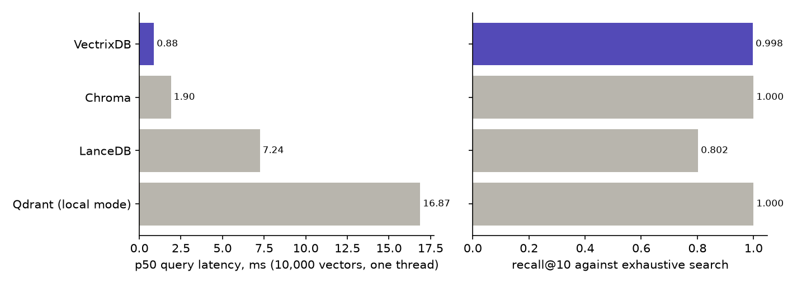

# Benchmarks

Every number on this page was printed by a script in the repository and pasted here unchanged. If a figure looks wrong, the script is the thing to argue with, and running it takes minutes.

## Index and storage: VectrixDB, Chroma, LanceDB, Qdrant

`scripts/benchmark_compare.py` embeds 10,200 real sentences once with the bundled English model and hands the identical vectors to each engine, so what is compared is the index and the storage, not four embedding models. Recall is against exhaustive cosine search over the same vectors. Latency is one thread issuing one query at a time, after a warm-up query, in a fresh directory with each library's defaults.

```bash
python scripts/benchmark_compare.py --size 10000 --queries 200 --k 10
```



| Engine | ingest 10,000 | recall@10 | p50 | p95 | QPS |
| --- | ---: | ---: | ---: | ---: | ---: |
| VectrixDB | 1.7 s | 0.998 | 0.88 ms | 1.16 ms | 1,091 |
| Chroma | 2.2 s | 1.000 | 1.90 ms | 2.34 ms | 510 |
| LanceDB | 4.0 s | 0.802 | 7.24 ms | 8.83 ms | 135 |
| Qdrant (local mode) | 32.6 s | 1.000 | 16.87 ms | 21.36 ms | 57 |

Windows 11, an Intel x86-64 CPU with 8 threads, Python 3.13, 384-dimensional vectors, the machine otherwise idle. Versions: chromadb 1.5.9, lancedb 0.38.0, qdrant-client 1.19.0, usearch 2.26.0, numpy 2.3.4, run on 19 September 2026. The raw figures, with the versions the script read, are in `benchmarks/compare.json`.

The order and the gaps hold from run to run; the milliseconds do not. An earlier run the same day, just as quiet, measured VectrixDB at 0.76 ms and Chroma at 1.62 ms, and the run on 11 September measured every engine three to four times slower (VectrixDB 3.24 ms, Chroma 7.73 ms, LanceDB 29.83 ms) because the test suite was running on the same CPU. Absolute milliseconds are the machine's, so run the script on yours. Recall moves too: LanceDB's has read 0.773, 0.814 and 0.802, because its IVF_PQ index is trained afresh each time, and VectrixDB's 0.999 and 0.998, because its graph is built on every core and comes out a little different each time.

What the table does and does not say:

- **VectrixDB and Chroma both run HNSW** (usearch and hnswlib) at their defaults. The latency gap is Python overhead around the index, not the index: VectrixDB fetches every result's payload in one SQLite statement and hashes the query cheaply, which this benchmark itself prompted. Before that change VectrixDB took three times as long as it does after it, on the same machine.
- **LanceDB's recall is lower** because its default index is IVF_PQ, a compressed index that trades recall for memory; its `nprobes` and refinement settings would raise it at the cost of latency. It is a fair result for defaults and an unfair one for LanceDB tuned.
- **Qdrant in local mode is exhaustive search**, not the server's HNSW, so its recall is 1.0 by construction and its latency grows linearly with the corpus. It is in the table because `pip install qdrant-client` is what an embedded user gets; the Qdrant server is a different product and would post different numbers.
- **Ingest** here is the index and the store only. In real use embedding dominates for every engine, and VectrixDB's model is on the CPU. Passing precomputed vectors, as this benchmark does, skips it.
- **Recall at 10,000 is not recall at 10 million.** HNSW recall drifts down as a graph grows and is edited in place; `rebuild_index()` exists for that reason. Larger runs will be added here when they have been run, not estimated.

## Retrieval quality: BEIR

`scripts/beir_eval.py` downloads a BEIR dataset on first use, indexes it with the bundled model, runs every judged query through the same `search()` a user calls, and computes nDCG@10 and recall@100 the way trec_eval does (linear gain, log2 discount), so the figures line up with published tables.

```bash
python scripts/beir_eval.py scifact
```

SciFact: 5,183 scientific abstracts, 300 judged claims.

| Search | nDCG@10 | recall@100 | query p50 | build |
| --- | ---: | ---: | ---: | ---: |
| dense | 0.707 | 0.938 | 10 ms | 10.9 min |
| hybrid, `rerank=False` | 0.736 | 0.968 | 163 ms | 11.2 min |
| hybrid, as it runs by default | 0.693 | 0.968 | 2,004 ms | the hybrid index |

bge-small-en-v1.5 INT8, the 2.2 default, on 19 September 2026, on the machine and in the quiet the comparison above ran in. The query column is one search as a user runs it: `limit=100` for the first two rows, and `limit=10` for the third, which reranks the top thirty (its recall column reads the unreranked list, since nobody reranks a hundred abstracts). Build is embedding and indexing all 5,183 abstracts on the CPU. The raw figures are in `benchmarks/beir_scifact_bge.json`.

Three things to read off this.

- **Hybrid beats dense** on a scientific corpus where exact terms matter, 0.736 against 0.707, and is above the paper's BM25 (0.665) and TAS-B (0.643) rows. It costs 163 ms a query against 10 ms: at `limit=100` it fetches a thousand candidates from each index and fuses them.
- **The bundled cross-encoder lowers the score here, and hybrid runs it by default.** Reranking took nDCG@10 from 0.736 to 0.693, as it did with the old model (0.723 to 0.695), for 2.0 seconds a query. It is ms-marco-MiniLM-L-12-v2, a twelve-layer MiniLM trained on MS MARCO web passages, and no judge of scientific claims. On a corpus like this one, pass `rerank=False`; on one that looks like web passages, measure it.
- **This run found a slowdown.** Its first pass timed hybrid at 1.1 s a query. The profile showed the library's hybrid search making highlights for all thousand keyword candidates and then dropping them; it no longer makes them, and the rows above are timed after that fix. Ranking was untouched: the quality columns match the first pass's to the third decimal.

The same harness with the pre-2.2 model, e5-small-v2, gave 0.650 dense and 0.723 hybrid (`benchmarks/beir_scifact_e5.json`), so the model change is worth six points dense and one point hybrid on this set.

**Two builds of the same vectors are not the same index.** usearch inserts on every core at once, so the graph comes out a little different each time. Five more builds of these vectors, with the collection's settings, scored between 0.704 and 0.708 nDCG@10 and between 0.933 and 0.943 recall@100; built on one thread, every build scored 0.707 and 0.945, which is exact search over these vectors, the ceiling. The build in the table reaches it at ten results and is 0.007 short at a hundred. A build of the same bit-identical vectors a week earlier, by that week's code, scored 0.699; hybrid, which fetches ten times the limit from each index, moved only in the fourth decimal between the two. The model table below has 0.713 for the same model by exact search, because `compare_models.py` embedded the abstracts in batches of its own, and an INT8 vector depends a little on what shares its batch (see [the limits](limits.md)).

(An earlier draft of this page quoted the e5 numbers as bge: the harness cached the index by dataset and mode only, reopened the e5 index, and the legacy path correctly kept e5 for it. The cache is keyed on the model now.)

For scale, the BEIR paper (Thakur et al., 2021, Table 2) reports nDCG@10 on SciFact of 0.665 for BM25, 0.318 for DPR, 0.643 for TAS-B, 0.671 for ColBERT and 0.688 for BM25 with a cross-encoder reranker. VectrixDB's dense model is bge-small-en-v1.5, a 384-dimensional encoder chosen by measurement (see the model comparison below); hybrid mode adds real BM25, and a cross-encoder on the top candidates unless `rerank=False`.

## Choosing the bundled dense model

`scripts/compare_models.py` embeds the fixture set and a BEIR dataset with each candidate and retrieves by exact cosine, so the number is the model's alone. This is the run that picked the 2.2 default.

| Model | Variant | fixture MRR | SciFact nDCG@10 | SciFact recall@100 |
| --- | --- | ---: | ---: | ---: |
| e5-small-v2 INT8, the default before 2.2 | bare | 0.961 | 0.645 | 0.924 |
| e5-small-v2 INT8 | with e5 prefixes | 0.928 | 0.646 | 0.922 |
| e5-small-v2 INT8 | with prefixes, 512 padding | 0.925 | 0.647 | 0.912 |
| bge-small-en-v1.5 fp32 | bare | 0.951 | 0.722 | 0.955 |
| bge-small-en-v1.5 fp32 | with bge query prefix | 0.938 | 0.706 | 0.943 |
| bge-small-en-v1.5 INT8, bundled from 2.2 | bare | 0.952 | 0.713 | 0.955 |
| snowflake-arctic-embed-xs fp32 | bare | 0.969 | 0.495 | 0.842 |
| snowflake-arctic-embed-xs fp32 | with prefix | 0.924 | 0.648 | 0.901 |

bge-small wins by nearly eight points of nDCG@10 at the same dimension, and the INT8 export keeps it. It is one dataset of scientific claims, and the choice it made is not free: on LongMemEval's conversations the same two models go the other way, 0.721 evidence recall for bge-small against 0.797 for e5-small-v2, which is on the [conversation memory page](../how-to/conversation-memory.md#measured). The e5 prefixes do nothing for retrieval here, arctic-embed-xs needs its prefix just to match e5, and padding to the longest text in a batch instead of 512 tokens costs nothing on SciFact, which is why it is now the default. The fixture set is too small to separate the models: one question in 48 is the whole gap.

## Recall against brute force, by size

`scripts/benchmark_recall.py` is the older, single-engine check that the ANN index and the distance function agree, on text the bundled model embeds. CI checks the same agreement on its own, in `tests/unit/test_hnsw_scaling.py`.

```bash
python scripts/benchmark_recall.py --sizes 500 --k 10
```

| Vectors | recall@10 | query p50 | query p95 | build |
| ------: | --------: | --------: | --------: | ----: |
| 500 | 0.964 | 8.3 ms | 9.5 ms | 2.6 s |

Recall is over 25 queries, so one wrong neighbour moves it by 0.004, and it moves between builds: the previous run read 0.984. The query column is embedding plus index, which is what a caller waits for. Embedding is about 7.6 ms of it on this CPU, measured on its own. An earlier version of this page reported 265 ms for the same step and 206 seconds to build; both were from before the INT8 export and before batches stopped padding to 512 tokens, and neither was re-run when those landed. They are re-run now.

## What is checked in CI

These are the numbers that fail a change rather than decorate a page:

- dense and hybrid MRR and recall@1 on the fixture question set (`tests/fixtures/recall_baseline.json`), tolerance 0.02
- HNSW recall against brute force (`tests/unit/test_hnsw_scaling.py`)
- the golden entity and edge set for a fixed corpus
- import time (`scripts/import_time.py --check 300`), wheel size against PyPI's 100 MiB limit, coverage and the mypy count, each against a recorded baseline. Memory per vector has a script, `scripts/measure_memory.py`, but no gate: it is measured when the storage layout changes, not on every push.
