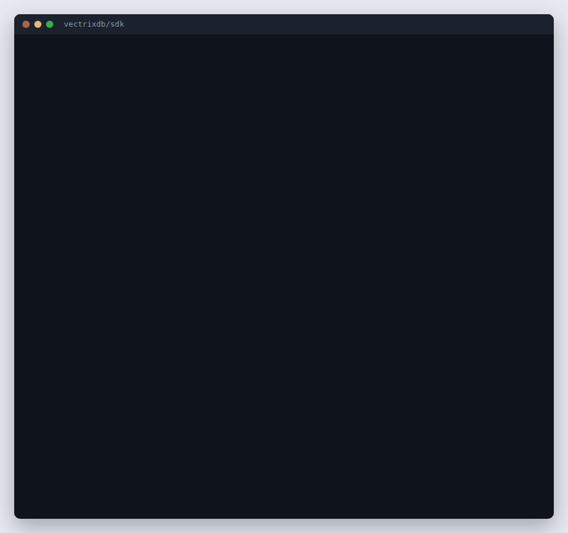

# Use it from Python, TypeScript, Go or Rust

A server somebody runs, a key they gave you, and code of your own. Four
clients talk to it with the same calls, spelled each language's way, so what
you learn in one reads the same in the others. Each is built from the
server's [OpenAPI description](../reference/rest-api.md) and passes the same
fourteen-step walk against a real server before a release.

You need **the address**, **a key** (or a company sign-in token) and **the
name of a collection** you may reach. [Build an app on it](build-an-app.md)
says how to ask for a key made for your app.

## Install

| Language | Install |
|---|---|
| Python | `pip install "vectrixdb[client]"` |
| TypeScript | `npm install vectrixdb` |
| Go | `go get github.com/knowusuboaky/VectrixDB/sdk/go/v2` |
| Rust | `cargo add vectrixdb` |

## Add a document, search, cite

=== "Python"

    ```python
    from vectrixdb import connect

    db = connect("https://vectors.company.com", key=KEY)
    db.add_document("handbook", open("handbook.pdf", "rb").read(), "handbook.pdf")
    for hit in db.search("handbook", "how long do refunds take", limit=3):
        print(f"{hit.score:.2f} [{hit.citation}] {hit.text}")
    ```

=== "TypeScript"

    ```ts
    import { VectrixClient } from "vectrixdb";
    import { readFileSync } from "node:fs";

    const db = new VectrixClient({ url: "https://vectors.company.com", key: KEY });
    await db.addDocument("handbook", readFileSync("handbook.pdf"), "handbook.pdf");
    for (const hit of await db.search("handbook", "how long do refunds take", { limit: 3 })) {
      console.log(hit.score.toFixed(2), `[${hit.citation}]`, hit.text);
    }
    ```

=== "Go"

    ```go
    db := vectrixdb.New("https://vectors.company.com", vectrixdb.WithKey(key))
    ctx := context.Background()
    f, _ := os.Open("handbook.pdf")
    db.AddDocument(ctx, "handbook", f, "handbook.pdf", nil)
    hits, _ := db.Search(ctx, "handbook", "how long do refunds take", &vectrixdb.SearchOptions{Limit: 3})
    for _, h := range hits {
        fmt.Printf("%.2f [%s] %s\n", h.Score, h.Citation, h.Text)
    }
    ```

=== "Rust"

    ```rust
    let db = vectrixdb::Client::new("https://vectors.company.com").key(key).build()?;
    db.add_document("handbook", std::fs::read("handbook.pdf")?, "handbook.pdf", Default::default()).await?;
    let opts = vectrixdb::SearchOptions { limit: 3, ..Default::default() };
    for hit in db.search("handbook", "how long do refunds take", opts).await? {
        println!("{:.2} [{}] {}", hit.score, hit.citation, hit.text);
    }
    ```



The server reads the file, cuts it into chunks and embeds them, so the client
sends bytes and nothing else: no model runs on your side. `citation` is the
string the server stamped on the chunk, `handbook.pdf#p12` or
`handbook.md#Refunds`, which is what an answer cites.

In Python, `search` returns the same `Results` and `Result` objects a local
`Vectrix` does, so code moves from a file on disk to a server by changing the
line that opens it. `AsyncVectrixClient` is the same with `await`.

## The calls

The same in every language; the table uses Python's spelling.

| Call | What it does |
|---|---|
| `health()`, `ready()` | whether the process answers, and whether its models are loaded |
| `whoami()` | who the server takes the key or token for |
| `collections()`, `describe(name)` | the collections the key may see, or one of them |
| `create_collection(name, dimension=384, text_index=True)` | a new collection; the text index makes hybrid search possible |
| `delete_collection(name)` | removes it |
| `add_document(collection, data, filename, doc_id=..., metadata=...)` | sends a file for the server to read, cut and embed |
| `add_texts(collection, [{"id", "text", "metadata"}])` | texts the server embeds as they are |
| `search(collection, query, limit=10, filter=..., rerank=False, mode="meaning")` | `mode="hybrid"` adds exact words to meaning |
| `documents(collection)`, `open_document(collection, doc_id)` | the documents kept, and the Markdown one was indexed from |
| `delete_document(collection, doc_id)` | removes a document and its chunks |
| `sources(collection)`, `add_source(collection, address, every="6h")` | pages and feeds the collection keeps up with |
| `refresh_sources(collection)`, `delete_source(collection, source_id)` | reads them again now, or stops following one |

`filter` is the simple form every search takes:
`{"team": "payroll", "year": {"$gte": 2024}}`. See [Filters](../reference/filters.md).

`documents` and `open_document` need a server started with
`VECTRIXDB_KEEP_SOURCE=1`; otherwise they answer 404 and say so.

## A key or a company token

A key goes in the `api-key` header. A person signed in through the company's
identity provider sends a token instead, and the server searches as that
person, so a collection's policy applies to them:

```python
db = connect("https://vectors.company.com", token=access_token)
```

In a browser, use a token, never a key: anything shipped to a browser can be
read by whoever opens it.

## When the server says no

Every refusal carries the status, one sentence for a person, and the
server's detail. Each language names the same kinds:

| Status | Python | TypeScript | Go (`errors.Is`) | Rust (`Kind`) |
|---|---|---|---|---|
| 401 | `AuthError` | `AuthError` | `ErrAuth` | `Auth` |
| 403 | `ForbiddenError` | `ForbiddenError` | `ErrForbidden` | `Forbidden` |
| 404 | `NotFoundError` | `NotFoundError` | `ErrNotFound` | `NotFound` |
| 409 | `ConflictError` | `ConflictError` | `ErrConflict` | `Conflict` |
| 413 | `TooLargeError` | `TooLargeError` | `ErrTooLarge` | `TooLarge` |
| 422 | `InvalidError` | `InvalidError` | `ErrInvalid` | `Invalid` |
| 429, 503 | `BusyError` | `BusyError` | `ErrBusy` | `Busy` |

```python
from vectrixdb import connect
from vectrixdb.client import NotFoundError

db = connect("https://vectors.company.com", key=KEY)
try:
    db.describe("handbok")
except NotFoundError as refused:
    print(refused.status, refused.message)   # 404 Collection 'handbok' not found
```

A 429 or 503 is retried three times first, waiting as long as the server's
`Retry-After` says, else 1, 2 and 4 seconds. A busy server under load answers
503 with `Retry-After` rather than holding the request, so the retries are
what spreads the load. Nothing else is retried.

## Behind a company network

Every client takes the same options for what stands between you and the
server, and refuses the same two mistakes:

```python
from vectrixdb import connect

db = connect(
    "https://gateway.company.com",
    key=KEY,
    key_header="Ocp-Apim-Subscription-Key",  # the header the gateway wants the key in
    prefix="/acme",  # the path every route lives under
    gateway_paths="api/v1=/files/search, auth=/files/auth",  # the gateway team's list
    verify="/etc/ssl/company-ca.pem",  # a company's own certificate authority, or "system"
)
```

| Option | Python | TypeScript | Go | Rust |
|---|---|---|---|---|
| key header | `key_header=` | `keyHeader` | `WithKeyHeader` | `.key_header()` |
| token header | `token_header=` | `tokenHeader` | `WithTokenHeader` | `.token_header()` |
| more headers | `headers=` | `headers` | `WithHeader` | `.header()` |
| a wrapper's name in `User-Agent` | `user_agent=` | `userAgent` | `WithUserAgent` | `.user_agent()` |
| gateway paths | `prefix=`, `gateway_paths=` | `prefix`, `gatewayPaths` | `WithPrefix`, `WithGatewayPaths` | `.prefix()`, `.gateway_paths()` |
| private CA | `verify="ca.pem"`, or `verify="system"` for the operating system's store | `NODE_EXTRA_CA_CERTS` | `WithHTTPClient` | `.ca_certificate(pem)` |
| client certificate | `cert=` | your own `fetch` | `WithHTTPClient` | `.identity(pem)` |
| proxy | `HTTPS_PROXY` | `NODE_USE_ENV_PROXY=1` | `HTTPS_PROXY` | `HTTPS_PROXY` |

- **No key over plain HTTP.** A client given a key or token for an
  `http://` address refuses to start unless the address is this machine;
  `allow_http` (`allowHttp`, `WithAllowHTTP`, `.allow_http(true)`) says
  otherwise on a network you trust.
- **No redirects.** A redirect would take the key with it, so it is
  reported, with the address it named, instead of followed.
- Certificates are always checked, and a key never appears in an error, a
  log line or the client's printed form.

The paths are read exactly as the server reads its own
`VECTRIXDB_GATEWAY_PATHS` ([Behind a gateway](behind-a-gateway.md)), so one
list serves both sides.

From a terminal, the `vectrixdb` command does all of this too, with a key
file or your company sign-in: [Use the command line on a server](command-line-server.md).
To give a company's people one package with all of it filled in, see
[Ship your own client or command on it](wrap-it.md).

## Another language

The four clients are thin: each call is one request, described in
[`sdk/CONTRACT.md`](https://github.com/knowusuboaky/VectrixDB/blob/main/sdk/CONTRACT.md).
For any other language, generate types from
[`openapi.json`](../reference/openapi.json) with that language's OpenAPI
generator and follow the contract for the envelopes, errors and retries.
`sdk/conformance/serve.py` starts a server to test against.
