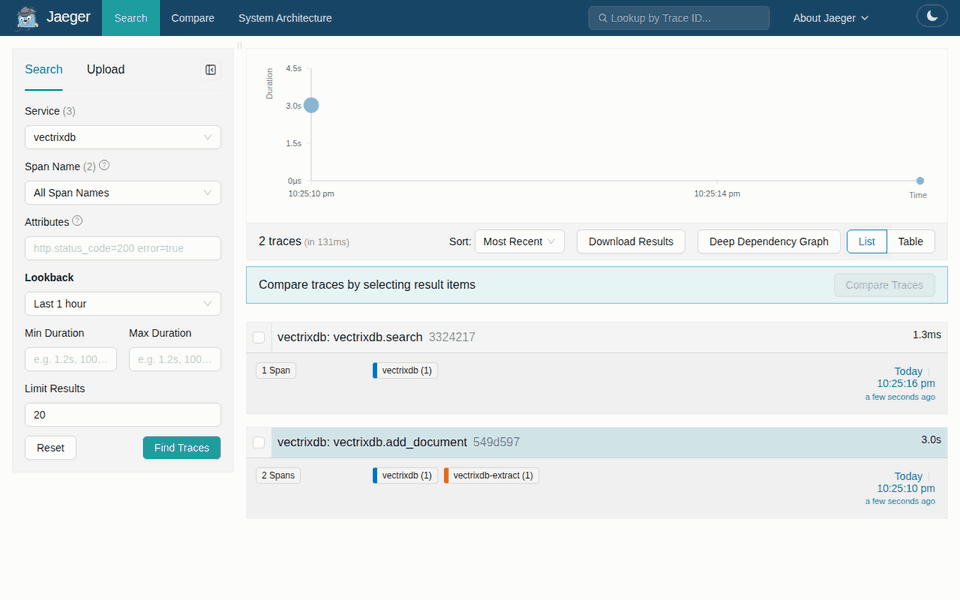

# Run it in containers

Every release publishes three images to GitHub's container registry, for Intel
and ARM, built from the same wheel PyPI has and checked before they are tagged:

| Image | What it runs | Port |
| --- | --- | --- |
| `ghcr.io/knowusuboaky/vectrixdb:2.2.0` | The server: the REST API, the dashboard and MCP at `/mcp`, with the English embedding model and reranker inside | 7337 |
| `ghcr.io/knowusuboaky/vectrixdb:2.2.0-full` | The same server with the multilingual embedding model and reranker as well, for collections in the hundred-odd languages besides English | 7337 |
| `ghcr.io/knowusuboaky/vectrixdb-extract:2.2.0` | The extraction service: scans, pictures, recordings, videos and YouTube addresses in, text out | 7338 |

`2.2.0` is that release, `2.2` the newest 2.2 release, and `latest` the newest
of all (`full` for the multilingual server). A release's tags can move to a
rebuild that picks up a security fix, so pin a digest where what runs must
never change; see [Verify an image](#verify-an-image-before-it-runs).

Both images hold to the same rules:

- **Nothing runs as root.** The user is 10001 in group 0, so a platform that
  picks its own user id, OpenShift for one, can still write the data.
- **The root filesystem can be read-only.** Everything written goes to `/data`,
  the one volume, or to `/tmp`.
- **Nothing is downloaded at run time.** The models are inside the image, which
  is what an air-gapped or egress-controlled network needs.
- **Neither starts open.** The server will not listen without
  `VECTRIXDB_API_KEY`, its `_FILE` twin or sign-in, and a read needs the key
  like everything else. The extraction service will not start without a key
  either, because every call to it can spend money on a paid reader.
- **A stop is clean.** A small init runs first, so a stop signal reaches the
  server and the requests in flight finish.
- **No known vulnerability with a fix.** Each image is scanned as it is built
  and every week after; see [What is scanned](#what-is-scanned).

## On one machine, with Docker Compose

From a checkout, or with `docker/compose.yaml` and `docker/compose.tracing.yaml`
downloaded into a folder of their own:

```bash
cd docker
python -c "import secrets; print(secrets.token_urlsafe(32))" > vectrixdb.key
sudo chown 10001 vectrixdb.key && sudo chmod 400 vectrixdb.key
docker compose up -d --wait
```

The dashboard is at http://localhost:7337, on this machine only, and asks for
the key in `vectrixdb.key`. A call sends it in the `api-key` header. Put a proxy
that terminates TLS in front of the server before opening it to a network.
An assistant connects at http://localhost:7337/mcp with a key the dashboard
makes it, and searches as that key: see
[Connect an assistant over MCP](mcp-server.md). `VECTRIXDB_MCP=0` turns the
endpoint off.

The containers run as user 10001 and read the key through a bind mount, which
keeps the file's owner and permissions, so on Linux the file must be readable
by that user: the `chown` gives it to that user and the `chmod` keeps it from
the machine's other users. On Docker Desktop, for Windows and macOS, leave out
the `sudo` line; the file is shared into the containers readable. `VECTRIXDB_KEY_FILE` names a
key kept somewhere else, and `VECTRIXDB_HOST_PORT` publishes the server on
another port than 7337.

Then send the server a scan. It hands the picture to the extraction service,
keeps the text it gets back and indexes it:

```bash
KEY="$(cat vectrixdb.key)"
curl -X POST http://localhost:7337/api/v1/collections -H "api-key: $KEY" \
  -H 'Content-Type: application/json' -d '{"name": "scans", "dimension": 384}'
curl -X POST http://localhost:7337/api/v1/collections/scans/documents -H "api-key: $KEY" \
  -H "X-Filename: invoice.png" -H "Content-Type: image/png" --data-binary @invoice.png
curl -X POST http://localhost:7337/api/v1/collections/scans/text-search -H "api-key: $KEY" \
  -H 'Content-Type: application/json' -d '{"query_text": "invoice total", "limit": 3}'
```


The extraction service is not published on the machine. Only the server
reaches it, on the network Compose makes for the two, with the same key.
PDFs with a text layer, Word and Excel files are read by the server itself;
see [Run an extraction service](extraction-service.md) for what goes where.

`docker compose down` stops both and keeps the collections, which live in named
volumes. `docker compose down --volumes` deletes them as well.

### See each search as a trace

```bash
docker compose -f compose.yaml -f compose.tracing.yaml up -d --wait
```

Jaeger starts beside the two, and the server sends it a span for every search,
document added and evaluation run. Jaeger's page is at http://localhost:16686:
pick the `vectrixdb` service to see each search, how long it took, which mode
ran, how many results it found and how well the best one scored. A scan you
upload is one trace across both containers, with the extraction service's
reading inside the upload. A span never carries the query, the document, its
name or the key. See
[Trace searches and ingestion](tracing.md) for every span and attribute, and for
sending them to a collector you already run.



## On Kubernetes

`docker/kubernetes` is a Kustomize setup: the server with its collections on a
volume of its own, the extraction service beside it, and a network policy that
lets only the server call the extraction service.

```bash
kubectl create namespace vectrixdb
kubectl -n vectrixdb create secret generic vectrixdb-key \
  --from-literal=api-key="$(python -c 'import secrets; print(secrets.token_urlsafe(32))')"
kubectl -n vectrixdb apply -k "https://github.com/knowusuboaky/VectrixDB//docker/kubernetes?ref=v2.2.0"
kubectl -n vectrixdb port-forward service/vectrixdb 7337:7337
```

The dashboard is then at http://localhost:7337, and every call takes the key in
the `vectrixdb-key` secret. A company that keeps its secrets in Vault, Azure
Key Vault or AWS Secrets Manager fills that secret with the External Secrets
Operator or the Secrets Store CSI driver instead. In a checkout,
`kubectl -n vectrixdb apply -k docker/kubernetes` applies the same thing.

Every pod meets the restricted Pod Security Standard: no root, no privilege
escalation, every capability dropped, the runtime's default seccomp profile and
a read-only root filesystem. Neither mounts a service account token, since
neither talks to the Kubernetes API. Label the namespace and the cluster holds
them to it:

```bash
kubectl label namespace vectrixdb pod-security.kubernetes.io/enforce=restricted
```

The network policy is kept by a cluster whose network plugin enforces policies,
which Calico, Cilium and the large clouds' plugins do. On OpenShift, which picks
the user itself, remove `runAsUser`, `runAsGroup` and `fsGroup` from the two
deployments; the image's group 0 lets that user write `/data`.

### A Service named vectrixdb

Kubernetes sets variables in every pod for each Service in the namespace, and
the Service named `vectrixdb` gives `VECTRIXDB_PORT=tcp://10.0.0.12:7337` and
others like it. That is why the port the server listens on is
`VECTRIXDB_LISTEN_PORT`, and the extraction service's
`VECTRIXDB_EXTRACT_LISTEN_PORT`. The pods here set `enableServiceLinks: false`
as well, so none of those variables is there. `vectrixdb check` passes over them
rather than call each one a misspelt setting, and when one lands on a setting
it reads, a Service named `vectrixdb-redis` setting `VECTRIXDB_REDIS_PORT` for
one, it says which Service did it and what to change.

### The multilingual server, tracing, a digest

The setup runs the English server. For the multilingual one, from a checkout:

```bash
cd docker/kubernetes
kustomize edit set image ghcr.io/knowusuboaky/vectrixdb=ghcr.io/knowusuboaky/vectrixdb:2.2.0-full
```

For production, pin both images by digest, so what runs is what was signed:

```bash
kustomize edit set image ghcr.io/knowusuboaky/vectrixdb=ghcr.io/knowusuboaky/vectrixdb@sha256:<digest>
```

The digest is the `Digest:` line of
`docker buildx imagetools inspect ghcr.io/knowusuboaky/vectrixdb:2.2.0`. To
trace, name your collector in `OTEL_EXPORTER_OTLP_ENDPOINT` in `server.yaml`
and `extract.yaml`, where the lines are there to uncomment.

### More than one replica

The server keeps its collections on one ReadWriteOnce volume, so it runs one
replica, and an update stops the old pod before the new one starts. More
replicas need state they can share: `VECTRIXDB_STORAGE_BACKEND` set to
`azure_search` or `cosmosdb` for the collections, and a `postgresql://` or
`cosmos://` address for `VECTRIXDB_SIGNIN_STORE` and
`VECTRIXDB_COLLECTION_STORE`. Then raise the replicas and make the strategy
`RollingUpdate`. See [Choose a storage backend](storage-backends.md).

## Settings

Every setting is an environment variable, as anywhere else; see the
[settings reference](../reference/settings.md). Secrets arrive as files, the way
Docker and Kubernetes mount them: `VECTRIXDB_API_KEY_FILE`,
`VECTRIXDB_EXTRACTOR_KEY_FILE`, and the `_FILE` twin every secret has. The
images set four themselves:

| Setting | In the image | Why |
| --- | --- | --- |
| `VECTRIXDB_PATH` | `/data` | The one volume |
| `VECTRIXDB_LISTEN_PORT`, `VECTRIXDB_EXTRACT_LISTEN_PORT` | `7337`, `7338` | The ports the images expose |
| `VECTRIXDB_OPEN_READS` | `0` | An image listens on every address, so a read needs the key like everything else. `1` gives back the library's open reads |
| `VECTRIXDB_ACCESS_LOG` | `stdout` | The platform keeps what a container writes to its output |

The server fetches the feeds and pages a collection keeps up with, its
[sources](sources.md), itself. On a network whose egress is controlled,
`VECTRIXDB_SOURCES_HOSTS` keeps it to the hosts you name, the ones the egress
rules let through, and a CronJob refreshes them with one POST.

Check a set of settings with the image itself before it starts anything, with
any file a setting names mounted where it says:

```bash
docker run --rm --env-file vectrixdb.env ghcr.io/knowusuboaky/vectrixdb:2.2.0 check
```

It says what a start would refuse and what would surprise you once it runs,
and exits `1` while there is an error, so it can gate a deployment. See
[Deploy the server](deploy.md#check-it-before-a-start).

## Verify an image before it runs

Each image is signed by the workflow that built it, with no key to keep or
leak: Sigstore's certificate names the workflow and the branch or tag it ran
from, and the signature is written to Sigstore's public transparency log. With
cosign 3:

```bash
cosign verify ghcr.io/knowusuboaky/vectrixdb:2.2.0 \
  --certificate-identity-regexp '^https://github\.com/knowusuboaky/VectrixDB/\.github/workflows/containers\.yml@refs/(heads/main|tags/v.+)$' \
  --certificate-oidc-issuer https://token.actions.githubusercontent.com
```

cosign 2.6 and later read the same signature with `--new-bundle-format` added.
The build's provenance is attested on GitHub as well:

```bash
gh attestation verify oci://ghcr.io/knowusuboaky/vectrixdb:2.2.0 --repo knowusuboaky/VectrixDB
```

Each image carries its SBOM, every package inside it, and its build
provenance, which the signature covers:

```bash
docker buildx imagetools inspect ghcr.io/knowusuboaky/vectrixdb:2.2.0 \
  --format '{{ json (index .SBOM "linux/amd64").SPDX }}' > vectrixdb.spdx.json
docker buildx imagetools inspect ghcr.io/knowusuboaky/vectrixdb:2.2.0 \
  --format '{{ json (index .Provenance "linux/amd64").SLSA }}'
```

An admission controller that checks Sigstore signatures, Kyverno for one, can
refuse any image without this one, given the identity and issuer above.

## What is scanned

Every image is scanned with Trivy as it is built, and a release is not tagged
while one has a high or critical vulnerability with a fix out. The Debian
packages under Python are brought up to date as an image is built, so a fresh
build has every fix Debian has published. Every week the published images are
scanned again, and what that finds goes to the repository's Security tab: a
finding there means a rebuild would pick up the fix, and a rebuild keeps the
release's tags. Vulnerabilities with no fix yet are not counted, since no
rebuild could change them. `trivy image ghcr.io/knowusuboaky/vectrixdb:2.2.0`
lists every one.

Unpacked, the server image is about 650 MB, the multilingual one about 950 MB,
and the extraction service about 1.2 GB with its speech model. A build fails
when one grows a fifth past that, which is what a dependency that drags in
something like PyTorch would do.

## Build your own

From a checkout:

```bash
docker build -f docker/Dockerfile -t vectrixdb .
docker build -f docker/Dockerfile --target extract -t vectrixdb-extract .
docker build -f docker/Dockerfile --build-arg MODELS=all -t vectrixdb:full .
```

| Build argument | What it does | Default |
| --- | --- | --- |
| `MODELS` | `all` adds the multilingual embedding model and reranker to the server, about 280 MB | empty |
| `WHISPER_MODEL` | The faster-whisper model the extraction service reads recordings with, put in the image so it reads them with no network. Empty leaves it out, for a deployment that always has Azure Speech | `base` |
| `SERVER_EXTRAS` | The extras the server installs | `api,signin,mcp,tracing,documents,feeds,azure,aws,postgres,jobs-azure` |
| `EXTRACT_EXTRAS` | The extras the extraction service installs | `api,signin,tracing,extract,youtube,ocr-azure,jobs-azure` |
| `PYTHON_IMAGE` | The base image, for a company that keeps its own copies | `python:3.12-slim`, pinned by digest |
| `DEBIAN_UPDATES` | `0` keeps the base image's packages as they are, for a build that cannot reach Debian | `1` |

Behind a proxy that inspects TLS, hand the build the proxy's certificate with
`--secret id=ca,src=company-ca.pem`; it is used while the image is built and
never written into it. `--build-context wheels=dist` builds from a wheel in
`dist` instead of the checkout, which is how a release builds from the wheel
PyPI has.

| Build secret | What it is | For |
| --- | --- | --- |
| `ca` | A certificate authority, PEM | a proxy that inspects TLS |
| `pip` | A `pip.conf` naming the company's package index, credentials and all | a build that reaches packages only through JFrog Artifactory, Nexus or the like |
| `mirrors` | Lines of `NAME=value`: `VECTRIXDB_MODELS_URL`, `VECTRIXDB_MODELS_TOKEN`, `HF_ENDPOINT`, `HF_TOKEN` | `MODELS=all` and the speech model, fetched from the company's mirror |

Each is mounted for the steps that need it and never written into a layer,
so `docker history` and the image's SBOM show none of them.
[Run it inside your company's registry](inside-your-registry.md) builds the
images that way, end to end.

Then check what you built the way a release is checked: every container started
read-only with every capability dropped, a collection made, filled and
searched, data kept across a restart, a platform's own user id, the Kubernetes
setup's mounted key and Service variables, an intranet feed kept current while
the cloud's metadata address stays out of reach, and the two images together
with a scan read, found and traced across both:

```bash
python scripts/container_smoke.py --server vectrixdb --extract vectrixdb-extract --whisper --compose
python scripts/container_smoke.py --server vectrixdb:full --full
```
