# Use the dashboard

`vectrixdb serve` also serves a dashboard at `/dashboard/`: the collections,
their health and text, search, the evaluation runs, and with sign-in on, who
may do what. It is plain JavaScript served by the server itself, with no build
step, and it works at phone, tablet and desktop widths.

```bash
pip install "vectrixdb[api]"
vectrixdb serve
```

Then open `http://127.0.0.1:7337/dashboard/`. What each page shows depends on
the role of whoever is signed in; see [Sign people in](sign-in.md#roles).

The pictures on this page are of a sample server. `python
scripts/dashboard_shots.py` fills one in, with made-up collections and two weeks
of made-up activity, and takes every picture again, so they show the dashboard
as it is after any change.

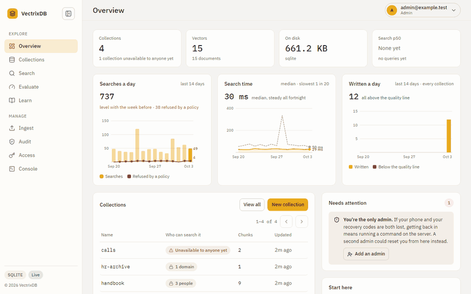

| Page | Who sees it |
| --- | --- |
| Overview, Collections, Learn | everybody signed in, and guests |
| Search | operators and admins |
| Evaluate | everybody signed in, and guests |
| Ingest, Console | operators and admins |
| Audit, Access | admins |

## Overview

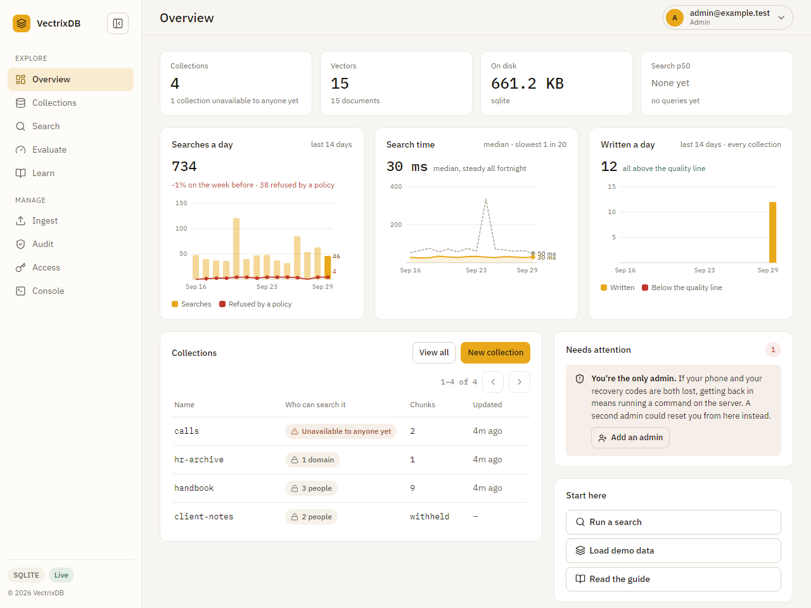

How much is stored, how fast searches are, the collections by when they last
changed, and what needs a person: a collection due a rebuild, a model that is
missing, the only admin with no second.

Between the tiles and the collections, three charts of the last fourteen
days: **searches a day**, with the searches a collection's policy refused
drawn over them as a red line for whoever may read the access log; **search
time**, the median and the slowest one in twenty, which is where search
getting slower over a week shows before anybody complains; and **written a
day**, the chunks written across every collection, the part under the
quality line in red, which is where a bad ingest shows, and a click on it
opens Ingest. They are counts and nothing else: no names, no collections. A
guest sees the same three, without the red line. Sign-ins against refusals
moved to the Access page, where the people are. The row is left out, rather
than drawn empty, when there is nothing to count from: no collections yet,
or no log and nothing written. The collections below them turn ten a page,
as every list on the dashboard does.
Days are UTC. Search time is what the server measured: a search's line in the
access log says how long the server took over it, and nothing about what was
asked. The card appears once a search has been timed, so a log from before 2.2
shows two charts until somebody searches. The Search p50 tile is still this
browser's own searches, which includes the network.

## Collections

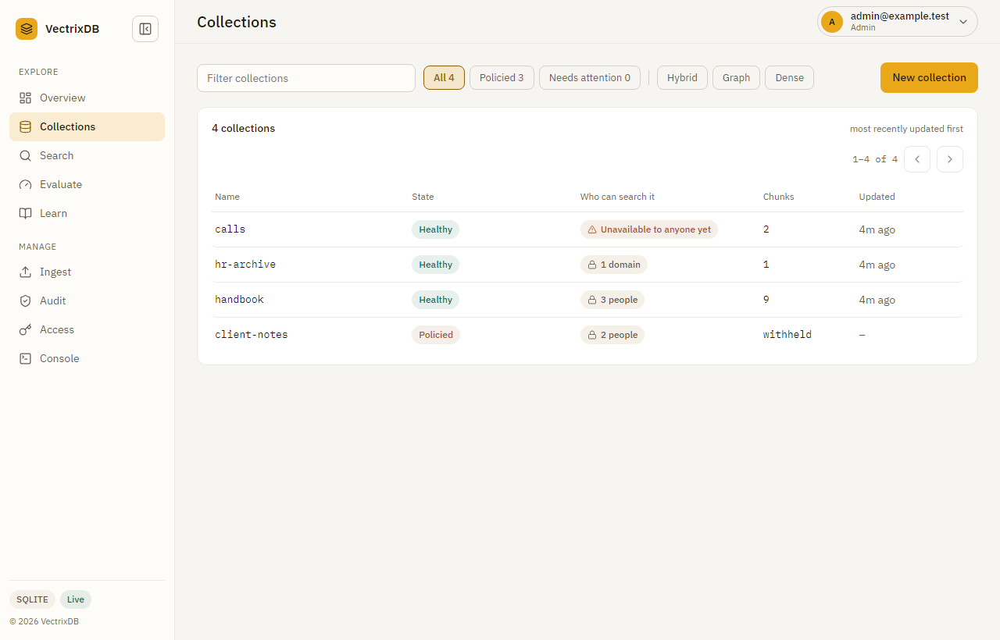

Every collection with its state, who may search it, its size and when it last
changed, ten a page. A collection opens on its own page: how it can be
searched, what it is built with (the store, the model that embedded it, what
read its files), and five tabs: Overview, Points, Policy, Builds and Quality.

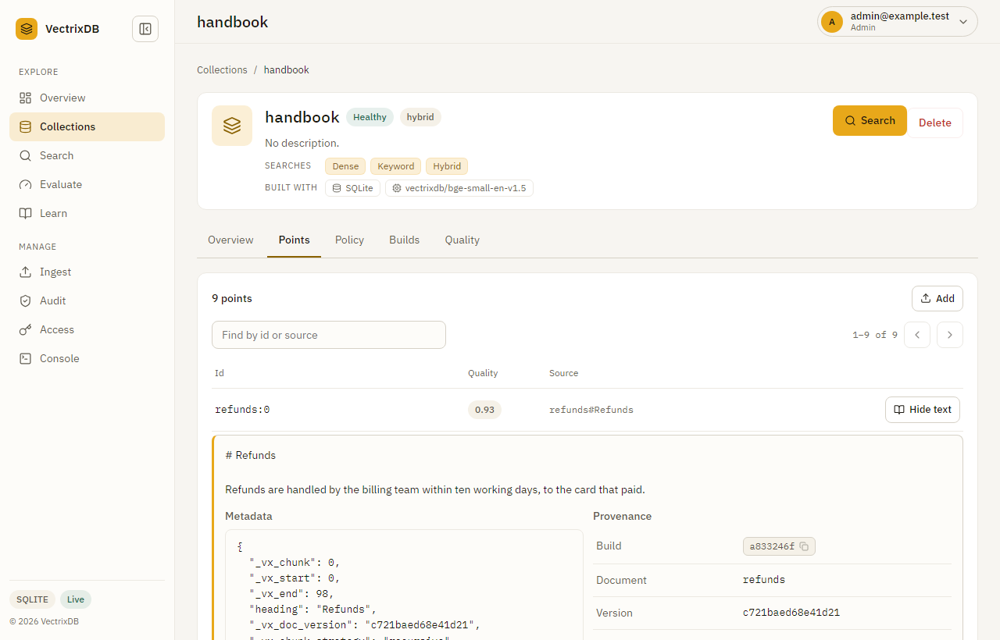

**Points** lists chunks by id, source and quality, never with their text.
**Show text** opens one chunk, and the access log names it. **Quality** lists
only the chunks under the quality line, with what is wrong with each in words.
**Builds** lists every index build that still has chunks, newest first, with
how each reads: its chunks' mean quality, marked when it is under the line.
Above the list, once there are two builds, **chunks by build**, oldest first,
with a build that reads badly in its own colour, which is where a bad ingest
shows at a glance. **Overview** draws **chunks written a day** for the last
thirty days under its tiles. Both are counted from what each chunk carries,
the time it was first written, its build and its quality score, so neither
needs a log or an audit trail, and both are what is here now: a chunk written
and since deleted is not in them.

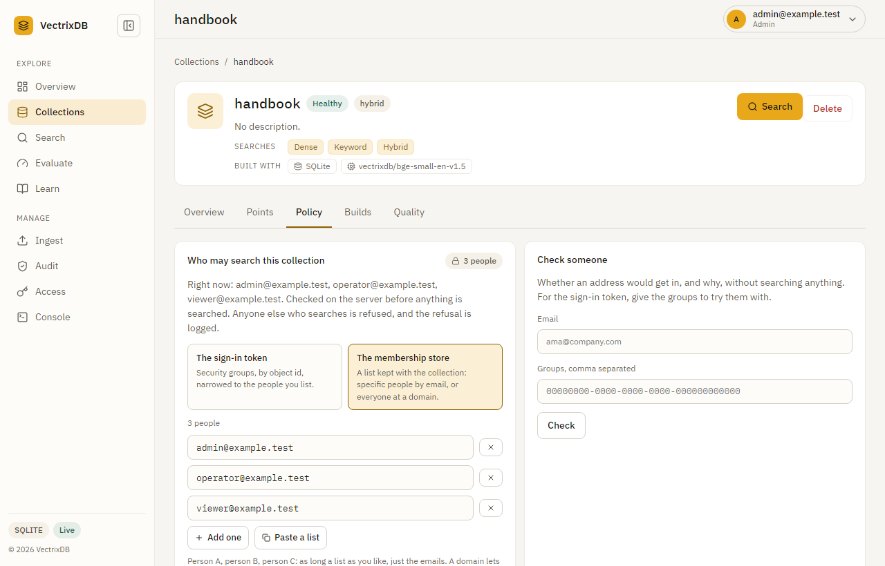

**Policy** is who may search the collection: people by work email, or everyone
at a domain, kept with the collection; or security groups from the sign-in
token, narrowed to a list of people. **Check someone** says whether an address
would get in, and why, without searching anything. A collection with no policy
is unavailable to anyone until one is set, and the list says so. Every save
asks for a check from the last ten minutes.

## Search

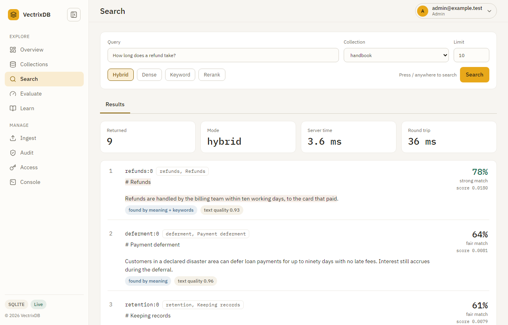

Dense, hybrid, keyword and reranked search, with the modes a collection cannot
do greyed out and saying why. Each result leads with its relevance, a
percentage and a word, and says whether meaning, keywords or both found it; the
score sits under it. **Copy as Python** gives the same search as a few lines of
Python. The Graph tab is there only when a collection on the server was made
for graph search, and draws that collection's knowledge graph; the graph
library is fetched the first time the tab is opened, so a server without
graphs never loads it. Press `/` anywhere to come here.

## Evaluate


The run in the picture was measured on the sample: twenty questions over nine
short documents, where every setup finds every answer, so the three picks all
name the fastest. It shows how the page reads, not how well a setup searches;
[Evaluate every setup](evaluate-setups.md) is how to measure your own.

Two tabs, Chunking first, and each opens on its newest run.

**Chunking** is the newest run of
[Compare the chunking techniques](measure-retrieval.md#compare-the-chunking-techniques):
the best technique, the next best against it with the questions only one of
the two got right, and whether the gap between them could be luck, every
technique ranked at its best settings, answered right by chunk size, and
answered against found for every build. Each technique's bar says what
happened to the questions: answered right, found and answered wrong, or not
found. A technique opens its own page with its sizes with headings in and
out, how it did against each of the others on the same questions, its runs,
and what changing one setting did. A run made with no model to answer counts
what was found instead, and says so.

**Retrieval** is the newest run of [Evaluate every setup](evaluate-setups.md):
the three picks, found in the top 10 against search time, found at each
depth, and every setup ranked, seven to a page. Each setup's bar says where
its answers landed in five bands: first, top 3, top 5, top 10 and missed. A
run saved before the top 5 had a band of its own is drawn with the four it
has. A setup opens its own page with how far down its answers were and its
top 10 run by run.

On both, the menu at the end of the golden data line opens an older run, and
an admin can download the golden file a run read. An address from before the
tabs, `#/evaluate/<setup>`, opens that setup under Retrieval. Runs are made by
the library, the command line or a function, never here.

## Ingest

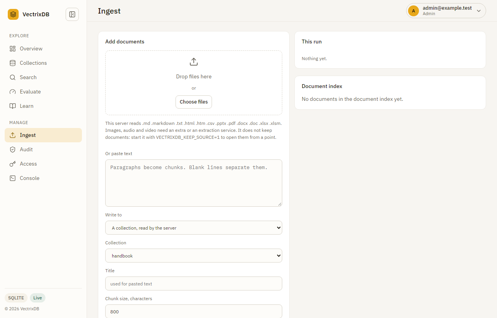

Send files to the server, which reads them the way `add_document()` does, or
paste paragraphs. It says which file types this server reads and who reads
each, and every document comes back with its chunk count, quality and
citations. Send two files or more and **Quality of this run** draws a bar for
each against the quality line, the ones under it in their own colour, so the
one scan that read badly stands out from the batch it came in with.

## Audit

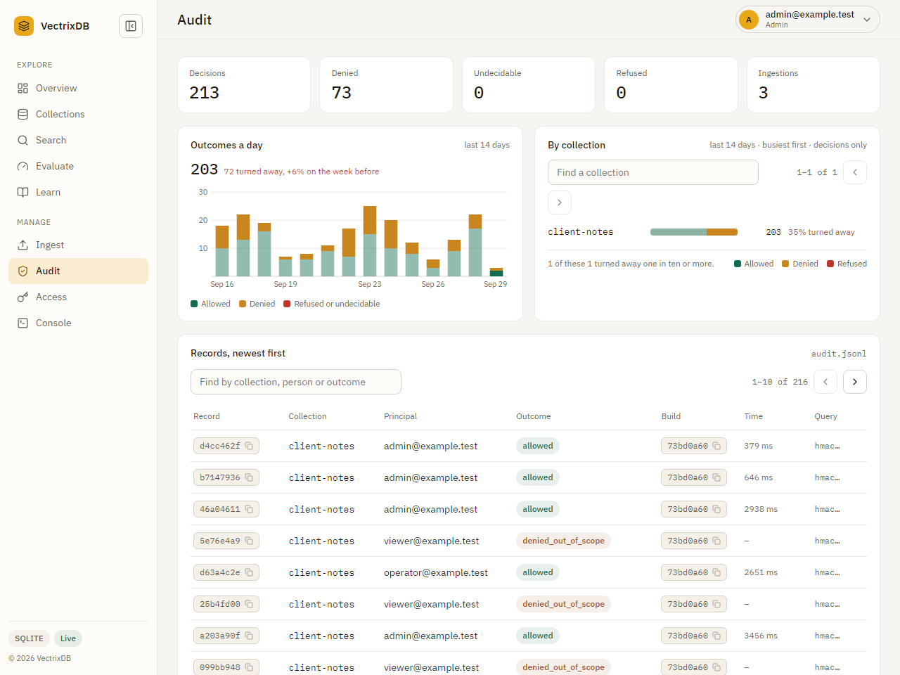

The audit trail a policied collection writes, for an admin, when the server is
pointed at it with `VECTRIXDB_AUDIT_JSONL`. Five totals over the whole trail,
then the last fourteen days twice: **outcomes a day**, allowed, denied, and
refused or undecidable stacked, which is where a day of denials stands out;
and **by collection**, the busiest first, with each one's denied and refused
counts in words beside the bar, because a thin slice of a long bar is easy to
miss. Every record in those days is counted, not only the newest ones listed
underneath. A collection with no policy makes no decisions, so it is not
there. Then the records, newest first: query text is never stored, only its
keyed fingerprint.

## Access

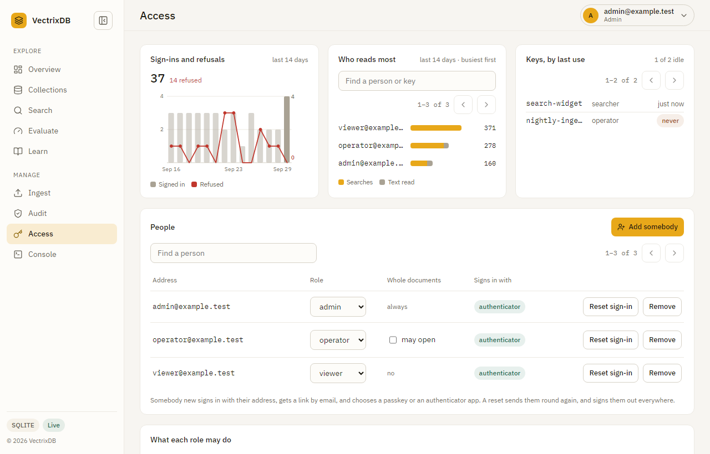

For admins: the people on the list and their roles, with single sign-on the
groups that decide them, what each role may do, and the access log, newest
first. Above them, **sign-ins against refusals** for the last fourteen days,
where a refusal is a failed sign-in or a request a role did not allow;
**who reads most**, the busiest people and keys of the last fourteen days
with searches and text read apart, ten a page; and **keys, by last use**,
ten a page, where a key not used for thirty days is marked: a key nobody
uses is a key to revoke. The first is left out when the log goes to the server's
output; the second is there for whoever may manage keys. Changing a role, like
changing who may search a collection or deleting one, asks for a check from the
last ten minutes.

## Signing in

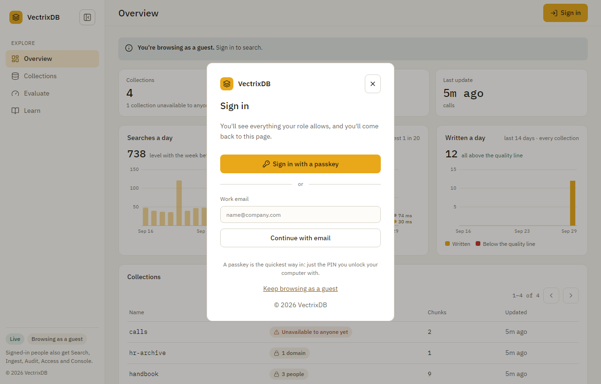

With sign-in on, the page opens on this card, or, with guests on, on the
Overview with a **Sign in** button. It offers what the server has turned on:
single sign-on, a passkey, a work email with an authenticator code, and a
password with the code where passwords are on.

## On a phone

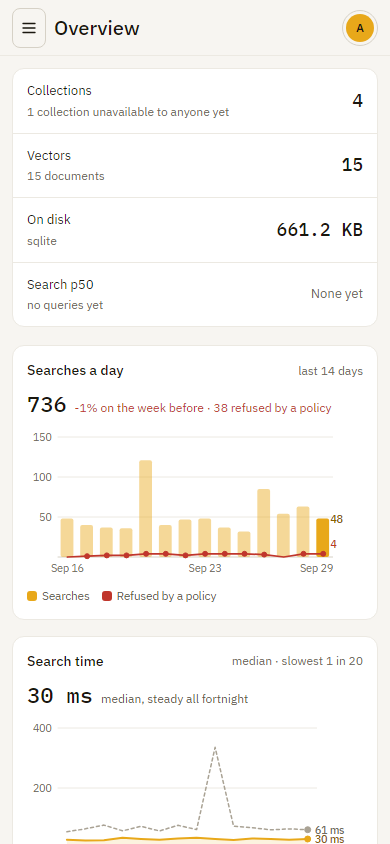

Every page works at phone width: tables become stacked rows, the sidebar
becomes a drawer, and every control is big enough to tap.

## The account menu

Your name at the top right opens the theme, light or dark, **How you sign
in** for your own passkeys, authenticator, recovery codes and signed-in
browsers, and for admins **API keys for scripts**, the Access page, and
**About**: which VectrixDB this is, its version, the Apache licence and the
NOTICE that travels with it.

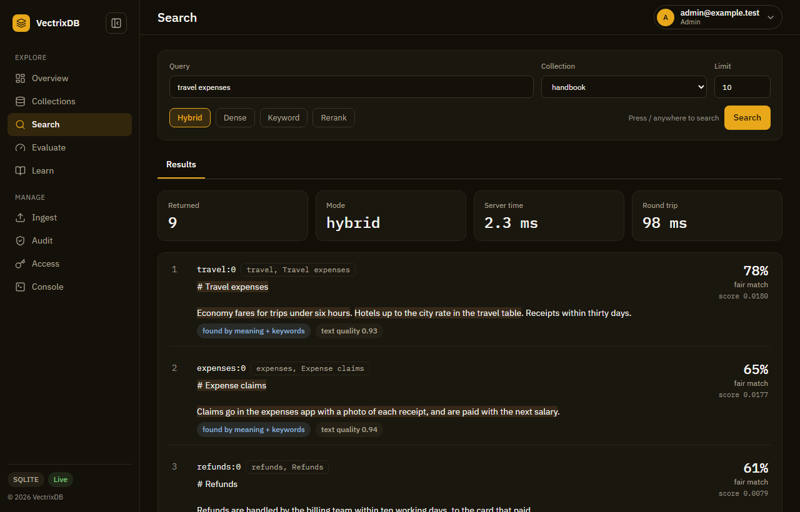

Put your company's name, logo, colours and line on all of it: see [Put your
company's name on it](branding.md).
