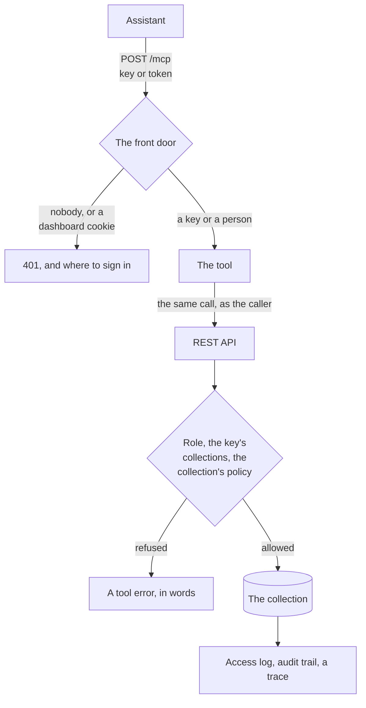
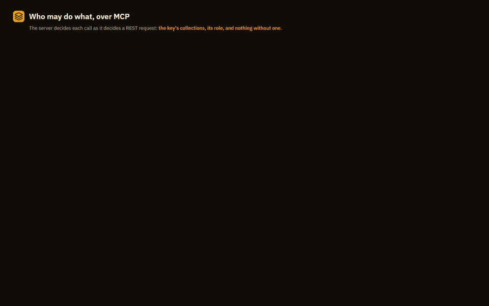

# Use your collections from an assistant over MCP

<div class="vx-hero" markdown>

<p class="lead">An assistant searches your collections as the person it works for, through the
same front door as the API: their role, their collections, each collection's policy,
the access log and the audit trail, on every call.</p>


<span class="vx-caption">Real calls to <code>/mcp</code> on a sample server, and the answers that came back.</span>

</div>

## Three ways in

<div class="grid cards vx-three" markdown>

- **Your company's sign-in**

    A person adds the URL and signs in with their work account. The assistant
    is then that person: the role their groups give them, and every policy
    judging every search as theirs.

    [Set it up](#connect-as-yourself-with-your-companys-sign-in)

- **Keys for a team**

    One key per person or app, `reader`, `searcher` or `operator`, for every
    collection or only the ones named. A key made for one collection cannot
    tell that the others exist.

    [Set it up](#connect-with-a-key)

- **On your own machine**

    One collection, one person, started by the client as a command. Search
    plus conversation memory: remember, recall, forget.

    [Set it up](#on-your-own-machine-for-one-person)

</div>

## How a call is decided



Every tool call is made to the REST API with the caller's own key or token, so
the server decides it exactly as it decides any request, and nothing about MCP
can be more open than the API it calls. The endpoint is stateless: any copy of
the server behind a load balancer answers any call.

## Turn it on

```bash
pip install "vectrixdb[api,signin,mcp]"
VECTRIXDB_MCP=1 vectrixdb serve
```

The endpoint is `https://<your server>/mcp`, streamable HTTP. A server that
does not set `VECTRIXDB_MCP` has no such endpoint. In the
[container image](containers.md) it is on.

## Connect with a key



Make a key on the Access page for each person or app that connects. Its role
decides what it may do:

| Key role | Over MCP it may |
| --- | --- |
| `reader` | list collections and open documents, not search |
| `searcher` | list, search and open |
| `operator` | the same, and add documents when the server allows writes |

A key made for named collections reaches those and nothing else: its list holds
only them, and any other answers as a collection that is not there. A
collection whose access is limited to named people opens to a key only when the
key was made for it.

=== "VS Code and most clients"

    ```json
    {
      "servers": {
        "vectrixdb": {
          "type": "http",
          "url": "https://vectors.company.com/mcp",
          "headers": { "api-key": "${input:vectrixdb-key}" }
        }
      },
      "inputs": [
        { "id": "vectrixdb-key", "type": "promptString", "description": "VectrixDB key", "password": true }
      ]
    }
    ```

=== "A client that takes a command line"

    ```bash
    <client> mcp add --transport http vectrixdb https://vectors.company.com/mcp \
      --header "api-key: $VECTRIXDB_KEY"
    ```

=== "Bearer only"

    ```json
    {
      "mcpServers": {
        "vectrixdb": {
          "url": "https://vectors.company.com/mcp",
          "headers": { "Authorization": "Bearer <the key>" }
        }
      }
    }
    ```

Keep a key out of a file anyone else reads: a prompt, a secret store or an
environment variable.

## Connect as yourself, with your company's sign-in

The client is given only the URL. Turned away with a `401` that names
`/.well-known/oauth-protected-resource/mcp`, it reads there which identity
provider signs people in, sends the person to sign in, and comes back with
their access token. There is no key to hand out and none to revoke when
somebody leaves: their account does that.

```json
{
  "servers": {
    "vectrixdb": { "type": "http", "url": "https://vectors.company.com/mcp" }
  }
}
```

On the server, single sign-on for apps is the same setting the API uses
([Sign people in](sign-in.md#tokens-for-apps)):

```bash
export VECTRIXDB_OIDC_ISSUER="https://login.microsoftonline.com/<tenant id>/v2.0"
export VECTRIXDB_OIDC_CLIENT_ID="<the server's application id>"
export VECTRIXDB_OIDC_API_AUDIENCE="api://vectrixdb"
export VECTRIXDB_OIDC_ROLE_MAP='{"<analysts group id>": "operator", "<everyone group id>": "viewer"}'
export VECTRIXDB_MCP=1
```

=== "Entra ID"

    1. In the server's app registration, **Expose an API** with the
       Application ID URI `api://vectrixdb`, and add a scope, `search`.
    2. Register the MCP client as an application of its own (public client,
       the redirect address the client documents), and under **API
       permissions** give it `api://vectrixdb/search`.
    3. Leave `VECTRIXDB_MCP_SCOPES` unset: the client asks for
       `api://vectrixdb/.default`, which includes it.

=== "Okta"

    1. Create an authorization server whose audience is `api://vectrixdb`, with
       a scope `vectrixdb.search` and an access policy for the MCP client.
    2. Register the MCP client as a native app with PKCE, and the redirect
       address the client documents.
    3. Set `VECTRIXDB_OIDC_ISSUER` to that authorization server, and
       `VECTRIXDB_MCP_SCOPES="vectrixdb.search"`.

=== "Any OIDC provider"

    The server checks the token's signature against the provider's published
    keys, its issuer, and that its audience is `VECTRIXDB_OIDC_API_AUDIENCE`.
    Register the audience as an API, register the client with PKCE, and name
    the scopes it asks for in `VECTRIXDB_MCP_SCOPES`.

A server with `VECTRIXDB_OIDC_API_CLIENTS` set takes tokens from the apps it
names alone, so the MCP client's own client id goes on that list too
([Run it inside your company's registry](inside-your-registry.md#require-the-companys-own-tool)).

A browser's dashboard session is not a way in: a page could otherwise make an
assistant's request for whoever has the dashboard open.

## The tools

| Tool | What it does |
| --- | --- |
| `list_collections()` | The collections the caller can reach, with their size, or that a policy decides who may search them. |
| `search(collection, query, mode, limit, filter, token_budget)` | Search as the caller. `mode` is `hybrid` (meaning and exact words, the default), `dense`, `keyword` or `rerank`; `filter` narrows by metadata. Each result comes with its relevance, its id and its source. |
| `open_source(collection, document, around, token_budget)` | The document a result came from, as it was indexed; `around` is words from the result, to read the part around them. Needs a role that may open documents. |
| `add_document(collection, text, title)` | Only with `VECTRIXDB_MCP_WRITES=1`, and only for a role that may write: the server reads, cuts and indexes it as it does any document. |

The prompt `answer_from_documents` asks the model to search first and cite what
it used. Every tool but `add_document` is marked read-only to the client.

On a collection with a per-document policy, hybrid search is not served: its
keyword half reads the text index directly, which no policy sees. `search` then
searches by meaning, judged document by document, and the answer's first line
says so. `keyword` is judged as the caller too. A collection made over the REST
API with its plain default has no index of exact words at all, and `search`
treats it the same way: by meaning, with the first line saying so, since the
assistant chose nothing about how the collection was made. Asking for `keyword`
there is refused, in the server's words.

A refusal comes back in the server's own words, as a tool error the model can
read and act on: `Your role does not allow this`, `Collection 'payroll' not
found`.

## Every call is in the log and in the trace

Each search an assistant makes is a line in the access log under the key's
name or the person's address, and a decision in the audit trail when a policy
judged it, the same as from the dashboard. With [tracing](tracing.md) on, it is
one trace from the call to `/mcp` to the collection's search:


## On your own machine, for one person

```bash
pip install "vectrixdb[mcp]"
vectrixdb mcp --name notes --path ./data --mode hybrid
```

The default transport is stdio, which is what a desktop assistant starts as a
command:

```json
{
  "mcpServers": {
    "vectrixdb": {
      "command": "vectrixdb-mcp",
      "args": ["--name", "notes", "--path", "/abs/path/to/data"]
    }
  }
}
```

| Tool | What it does |
| --- | --- |
| `search(query, limit, token_budget, mode)` | Search the collection. |
| `recall(query, session, limit, token_budget)` | Conversation memories, weighted by recency and feedback. |
| `remember(text, session, role, pinned)` | Store a turn, or a pinned fact. |
| `feedback(id, outcome, correction)` | Grade a memory: `useful`, `dead_end`, `corrected`. |
| `context(query, session, token_budget, recent_turns)` | A ready context block: pinned facts, recent turns, relevant memories. |
| `forget(session, older_than_days, ids, superseded, all_sessions)` | Delete memories for good: by ids, by age within a session, or only superseded facts. A call with none of these deletes nothing unless `all_sessions=true`. The one tool that deletes. |

`--transport sse` and `--transport streamable-http` serve it on this machine
for other hosts. Over HTTP, `remember`, `feedback` and `forget` are left out
unless `--allow-writes` is given, since anything on the machine that reaches
the port may call them. There is no sign-in on this server: to share a
collection, use `vectrixdb serve` as above.

## Every answer says whether it was cut

Every tool takes a `token_budget`, and every answer starts with a line that says whether anything was cut:

```
[!] TRUNCATED: showing 3 of 9 results (~200-token budget). The answer may be among the 6 cut. Raise token_budget or narrow the query.
```

or, when nothing was:

```
[i] 9 results, ~410 of a 2000-token budget.
```

A tool result goes straight into the model's context, so a silently shortened list would read as a complete one and the model would reason from an absence that is not there. The header exists so that cannot happen.

## Use it from Python instead

The local server's tool bodies are plain functions, so a host that already has a `Vectrix` can call them without the `mcp` package:

```python
from vectrixdb import Vectrix
from vectrixdb.mcp_server import tool_context

db = Vectrix("memory", path="./data")
db.remember("we decided to ship on Friday", session="u42", role="user")

print(tool_context(db, "what did we decide", session="u42", token_budget=800))
```

`build_server(db)` returns the configured MCP server for hosts that want to mount it themselves; `build_server(db, writes=False)` leaves out the tools that change the collection.
