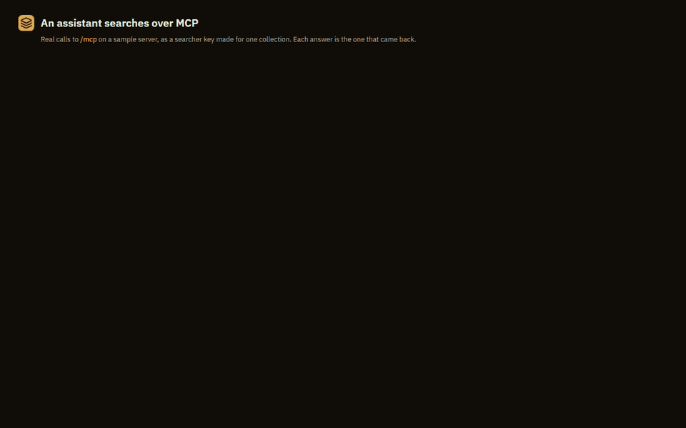
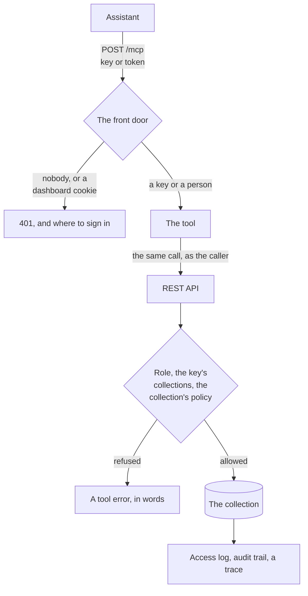

# Use your collections from an assistant over MCP

<div class="vx-hero" markdown>

<p class="lead">An assistant searches your collections as the person it works for, through the
same front door as the API: their role, their collections, each collection's policy,
the access log and the audit trail, on every call.</p>


<span class="vx-caption">Real calls to <code>/mcp</code> on a sample server, and the answers that came back.</span>

</div>

MCP is how an assistant finds tools and calls them. A VectrixDB server with it
on answers at `/mcp` with tools to list, describe, search and read its
collections, and the assistant uses them the way a person uses the dashboard.

## Three ways in

<div class="grid cards vx-three" markdown>

- **Your company's sign-in**

    A person adds the URL and signs in with their work account. The assistant
    is then that person: the role their groups give them, and every policy
    judging every search as theirs.

    [Set it up](mcp-sign-in.md)

- **Keys for a team**

    One key per person or app, `reader`, `searcher` or `operator`, for every
    collection or only the ones named. A key made for one collection cannot
    tell that the others exist.

    [Set it up](mcp-keys.md)

- **On your own machine**

    One collection, one person, started by the client as a command. Search
    plus conversation memory: remember, recall, forget.

    [Set it up](mcp-local.md)

</div>

## How a call is decided



Every tool call is made to the REST API with the caller's own key or token, so
the server decides it exactly as it decides any request, and nothing about MCP
can be more open than the API it calls. The endpoint is stateless: any copy of
the server behind a load balancer answers any call.

Three kinds of caller get in: a person's access token from your company's
sign-in, a named key an admin makes on the dashboard, and the server's own
`VECTRIXDB_API_KEY`, which is an admin's. A browser's dashboard session is not
one of them. A server with no key and no sign-in answers MCP only from its own
machine.

## Turn it on

```bash
pip install "vectrixdb[api,signin,mcp]"
VECTRIXDB_MCP=1 vectrixdb serve
```

The endpoint is `https://<your server>/mcp`, streamable HTTP. A server that
does not set `VECTRIXDB_MCP` has no such endpoint. In the
[container image](containers.md) it is on, and `VECTRIXDB_MCP=0` turns it off.

`VECTRIXDB_MCP_WRITES=1` adds the tools that change a collection. Without it an
assistant only reads, whatever the caller's role allows.

Then [connect your client](mcp-connect.md).

## The tools

| Tool | What it does |
| --- | --- |
| `list_collections` | The collections the caller can reach. |
| `whoami` | Who the caller is here, their role, and what it allows. |
| `describe_collection` | A collection's size, how it is searched, and the fields a filter can name. |
| `list_documents` | The documents a collection holds. |
| `search` | Search as the caller: hybrid, dense, keyword or rerank, with a filter and facets. |
| `similar` | More like a result already in hand. |
| `open_source` | The document a result came from. |

With writes on, five more: `add_document`, `create_collection`,
`delete_document`, `add_source` and `refresh_source`. There are four prompts
and two resources as well. Every one, with its arguments and what it refuses,
is in the [tools reference](mcp-tools.md).

A refusal comes back in the server's own words, as a tool error the model can
read and act on: `Your role does not allow this`, `Collection 'payroll' not
found`.

## Every call is in the log and in the trace

Each search an assistant makes is a line in the access log under the key's
name or the person's address, and a decision in the audit trail when a policy
judged it, the same as from the dashboard. With [tracing](tracing.md) on, it is
one trace from the call to `/mcp` to the collection's search: a span named
`mcp.tool` with the tool and the collection, marked when it was refused, over
the search it ran.


## Next

- [Connect your client](mcp-connect.md): the config for each kind of client.
- [Company sign-in for MCP](mcp-sign-in.md): people sign in as themselves.
- [Keys for a team](mcp-keys.md): roles, scoped keys, and where to make them.
- [Tools reference](mcp-tools.md): every tool, prompt and resource.
- [On your own machine](mcp-local.md): one collection, one person, no server.
