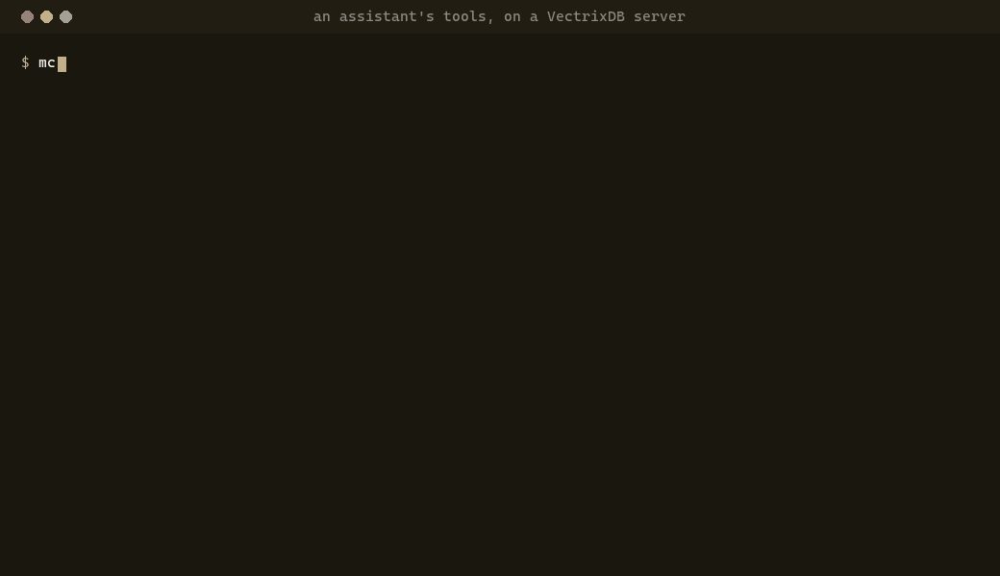

# Tools reference

Every tool, prompt and resource the server's `/mcp` endpoint offers. Each tool
is one or two calls to the REST API made as the caller, so the caller's role,
their collections and each collection's policy decide the answer. What a role
may call is on [Keys for a team](mcp-keys.md#roles).

For the one-person server started with `vectrixdb mcp`, see
[On your own machine](mcp-local.md).


<span class="vx-caption">Real tool calls to a server started for the clip, and what each answered.</span>

## The tools that read

Offered to every caller. Each is marked read-only to the client.

| Tool | Arguments | What it answers |
| --- | --- | --- |
| `list_collections` | none | The collections the caller can reach, each with its size in chunks and its description, or `policied` when a policy decides who may search it. |
| `whoami` | none | Who the caller is, how they came in (an API key or your company's sign-in), their role, the collections they reach, and the actions the role holds. |
| `describe_collection` | `collection` | Its size, dimensions and metric; whether hybrid search works or it searches by meaning only; the metadata fields a filter can name, with an example filter; and whether a policy decides document by document. |
| `list_documents` | `collection`, `title`, `limit` | The documents it holds, by id and title. `title` keeps those whose id or title contains it. `limit` is 50 unless given, 200 at most. Needs a server that keeps documents. |
| `similar` | `collection`, `id`, `limit`, `filter`, `token_budget` | The chunks most like one a search already returned, by its `id`. Judged as the caller, like a search. |
| `search` | `collection`, `query`, `mode`, `limit`, `filter`, `token_budget`, `facets` | Search as the caller. Each result has its relevance, its id and its source. See below. |
| `open_source` | `collection`, `document`, `around`, `token_budget` | The document a result came from, as it was indexed. See below. |

### search

| Argument | What it does |
| --- | --- |
| `collection` | The collection's name. |
| `query` | The words to search for. An empty query is refused. |
| `mode` | `hybrid`, meaning and exact words, the default. `dense`, meaning. `keyword`, exact words. `rerank`, meaning, then the best re-ordered first. Any other value is refused. |
| `limit` | How many results, 10 unless given, 50 at most. |
| `filter` | A JSON object that narrows by metadata, such as `{"department": "legal"}`. `describe_collection` names the fields there are. |
| `token_budget` | What the answer is cut to: 2000 tokens unless given, between 200 and 20000. |
| `facets` | Metadata fields to count over the results, such as `["department", "year"]`. |

`hybrid` suits most questions, `keyword` suits names, codes and exact phrases,
and `rerank` is slower and puts the best first.

Two collections cannot answer `hybrid` as it is, and `search` answers them by
meaning instead, with a first line that says so. The assistant chose nothing
about how the collection was made, so it is not told to fix it:

- **A collection with a per-document policy.** Hybrid search's keyword half
  reads the text index directly, which no policy sees, so it is not served
  there. The search runs by meaning, judged document by document. `keyword`
  on its own is judged as the caller too.
- **A collection with no index of exact words**, which is what a collection
  made over the REST API with its plain default is. Asking for `keyword` there
  is refused, in the server's words.

With `facets`, the answer ends with how the results spread over each field:

```text
[i] Facets over these 10 results:
- department: legal 6, finance 4
- year: 2025 7, 2024 3
```

The counts are over the results this search returned, and the line says so, so
a model does not take them for the whole collection.

### open_source

| Argument | What it does |
| --- | --- |
| `collection` | The collection's name. |
| `document` | The document a result came from, as the result names it. |
| `around` | Words from the result. The part of the document around them is read, starting a little before them. |
| `token_budget` | How much to read: 2000 tokens unless given, between 200 and 20000. |

When the whole document fits, the first line says so. When it does not, the
first line says which characters were read out of how many, and to pass
`around` or raise `token_budget`. `open_source` needs a role that may open whole
documents.

## The tools that write

Offered only when the server has `VECTRIXDB_MCP_WRITES=1`, and then judged by
the caller's role: a role that may not write is refused.

| Tool | Arguments | What it does |
| --- | --- | --- |
| `add_document` | `collection`, `text`, `title` | Adds a text or Markdown document. The server reads, cuts and indexes it as it does any document. `title` becomes the file name, with `.md` added unless it ends in `.md` or `.txt`; left out, it is `from-assistant.md`. When it replaces a document already there, the answer says which. |
| `create_collection` | `collection`, `description`, `hybrid` | Makes an empty collection. `hybrid`, true unless given, searches by meaning and exact words. Needs a role that may make collections. |
| `delete_document` | `collection`, `document` | Deletes a document and every chunk of it, for good. Marked destructive to the client, so a client asks its person first. |
| `add_source` | `collection`, `address`, `every`, `kind` | Has the collection keep up with a feed or a web page, read every `every` (`30m`, `6h`, `1d`; `6h` unless given). `kind` is `feed` or `page`; left out, the server tells. Nothing is written until a refresh. See [Keep a collection in step with feeds and pages](sources.md). |
| `refresh_source` | `collection`, `source`, `force` | Reads the collection's sources now: one, by its id or address, or every one that is due. `force` reads every one. Answers with how many entries were added, updated, unchanged, removed and failed. |

Every write tool is marked as not read-only. Only `delete_document` is marked
destructive. `add_source` and `refresh_source` are marked as reaching outside
the server, since they read addresses on the web.

## Prompts

A client offers these to its person, usually as commands they pick.

| Prompt | Arguments | What it asks the model to do |
| --- | --- | --- |
| `answer_from_documents` | `question`, `collection` | Answer the question from the collection, or from every collection when none is named. Search first, use only what the results say, cite every claim by its source, and say plainly when they do not answer it. |
| `summarise_document` | `collection`, `document` | Read the document with `open_source` and give its main points, each with where in the document it is, and what it does not cover that a reader would expect. |
| `whats_in_collection` | `collection` | Describe the collection with `describe_collection`, `list_documents` and a search or two, and end with three questions it answers well. |
| `compare_documents` | `collection`, `first`, `second`, `question` | Read both documents and say where they agree, where they differ, and what one covers that the other does not, citing each point. `question` is optional. |

## Resources

A person can attach these to a conversation in a client that supports
resources. Each is read as the caller.

| Resource | What it is |
| --- | --- |
| `vectrixdb://collections/{collection}` | The collection's size, how it is searched, and its filterable fields, as `describe_collection` gives them. Plain text. |
| `vectrixdb://collections/{collection}/documents/{+document}` | The document as it was indexed, as Markdown. `{+document}` may hold slashes, so a document id like `policies/leave.md` works as it is. |

## Every answer says whether it was cut

A tool's answer goes straight into the model's context. A list cut short
without a word reads as a complete one, and the model would reason from an
absence that is not there. So every answer starts with a line that says what it
is. When nothing was cut:

```text
[i] 9 results from handbook, ~410 of a 2000-token budget.
```

When something was:

```text
[!] TRUNCATED: showing 3 of 9 results from handbook (~200-token budget). The answer may be among the 6 cut: raise token_budget or narrow the query.
```

`[i]` is information and `[!]` is a warning. A search that found nothing says
so on its first line too, and suggests another mode or fewer words. Each result
follows as its number, its relevance, its id, its source and its text:

```text
1. [82%] id=leave-3 source=policies/leave.md
   Parental leave is up to 18 months ...
```

The answer ends with a reminder to cite each result by its source, and that
`open_source` reads the document around it.

## What the model is told

The server sends instructions to every client when it connects, and a client
hands them to its model. They say that the server returns only what the person
may read and a refusal is its answer, which the model reports and does not work around; to start with
`list_collections` when the name is not known, and `describe_collection` before
writing a filter; which mode suits what; to answer from what the results say
and cite each claim by its source; and to ask the person before deleting
anything.

For assistants that load skills, `skills/vectrixdb-mcp/SKILL.md` in the
repository says the same at more length, with when to use each tool. It is
optional: the instructions reach every client anyway.
