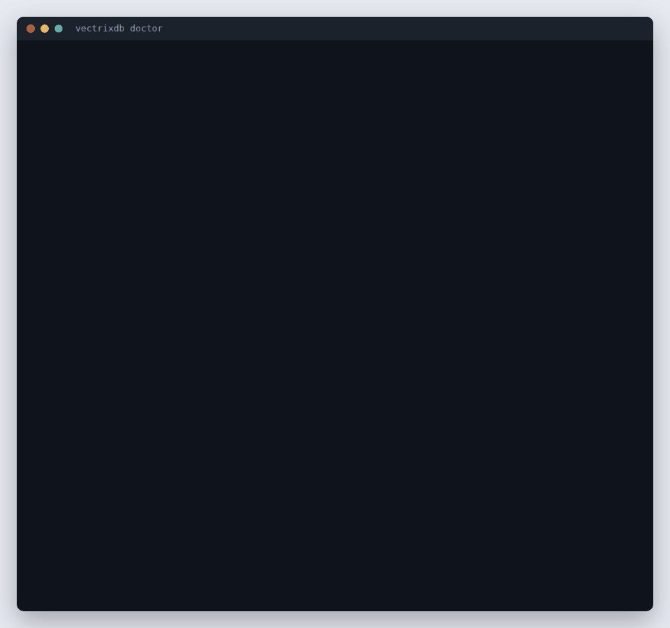

---
hide:
  - navigation
  - toc
---

<div class="vx-hero" markdown>

# The vector database that works <em>with no network and no accounts</em>

<p class="lead">Embedded ONNX models, GraphRAG, and eight storage backends.
Nothing to sign up for, no API key, no service to run. <code>pip install</code> and search.</p>

<div class="vx-actions" markdown>
[Get started](tutorial/getting-started.md){ .md-button .md-button--primary }
[Use the dashboard](how-to/dashboard.md){ .md-button }
[Command line](how-to/command-line-server.md){ .md-button }
[SDKs](how-to/clients.md){ .md-button }
[MCP](how-to/mcp-server.md){ .md-button }
[GitHub](https://github.com/knowusuboaky/VectrixDB){ .md-button }
</div>


<span class="vx-caption">A question goes in, and every result says how well it matched and what found it: meaning, keywords, or both.</span>

</div>

```bash
pip install vectrixdb
```

```python
from vectrixdb import Vectrix

db = Vectrix("my_docs")
db.add(["Python is great", "JavaScript powers the web", "Rust is fast"])

results = db.search("programming")
print(results.top.text)
```

That is the whole setup. The embedding model ships in the package, so the first
search works offline on a machine that has never seen an API key.

## Every way in

The same collections answer a Python program, the `vectrixdb` command, a
client in TypeScript, Go or Rust, and an assistant over MCP. Each client keeps
the same safety rules: no key over plain HTTP, no redirects, certificates
always checked.

=== "Command line"

    ```bash
    pip install "vectrixdb[client]"
    vectrixdb login --url https://vectors.example.com --device
    vectrixdb query "how long do refunds take?" --name handbook
    ```

    [Use the command line on a server](how-to/command-line-server.md)

=== "Python"

    ```bash
    pip install "vectrixdb[client]"
    ```

    ```python
    import vectrixdb

    db = vectrixdb.connect("https://vectors.example.com", key="...")
    ```

    [Use it from Python, TypeScript, Go or Rust](how-to/clients.md)

=== "TypeScript"

    ```bash
    npm install vectrixdb
    ```

    ```ts
    import { VectrixClient } from "vectrixdb";

    const db = new VectrixClient({ url: "https://vectors.example.com", key: "..." });
    ```

    [Use it from TypeScript](how-to/clients.md) · [npm](https://www.npmjs.com/package/vectrixdb)

=== "Go"

    ```bash
    go get github.com/knowusuboaky/VectrixDB/sdk/go/v2
    ```

    ```go
    db := vectrixdb.New("https://vectors.example.com", vectrixdb.WithKey(key))
    ```

    [Use it from Go](how-to/clients.md) · [pkg.go.dev](https://pkg.go.dev/github.com/knowusuboaky/VectrixDB/sdk/go/v2)

=== "Rust"

    ```bash
    cargo add vectrixdb
    ```

    ```rust
    let db = vectrixdb::Client::new("https://vectors.example.com").key(&key).build()?;
    ```

    [Use it from Rust](how-to/clients.md) · [crates.io](https://crates.io/crates/vectrixdb) · [docs.rs](https://docs.rs/vectrixdb)

=== "MCP"

    ```bash
    pip install "vectrixdb[mcp]"
    vectrixdb mcp --name handbook
    ```

    [Use your collections from an assistant over MCP](how-to/mcp-server.md) ·
    [Coding agents](how-to/coding-agents.md)

## See it work

`pip install "vectrixdb[api]"` and `vectrixdb serve` give the same collections
a REST API and a dashboard. These are the real pages, the real commands and
the real containers, filmed by the scripts that keep the pictures current.

<div class="vx-tours" markdown>

<div class="vx-tour" markdown>

### [Command line](how-to/command-line-server.md)
`vectrixdb` pointed at a server: a folder ingested, a search with citations, and a key it will not send over plain HTTP.
</div>

<div class="vx-tour" markdown>

### [SDKs: Python, TypeScript, Go, Rust](how-to/clients.md)
One server, one document, and the same search from four languages, each answering with the same citation.
</div>

<div class="vx-tour" markdown>

### [MCP](how-to/mcp-server.md)
An assistant connects, lists the collections and searches them, with real calls and real answers.
</div>

<div class="vx-tour" markdown>

### [Doctor](how-to/deploy.md#then-try-every-part-of-it)
`vectrixdb doctor` tries every part of an install and says what to do about anything missing.
</div>

<div class="vx-tour" markdown>

### [Ingest](how-to/ingest-documents.md)
A PDF goes in. The server says what it read: pages, chunks, and a citation for each.
</div>

<div class="vx-tour" markdown>

### [Collections](how-to/dashboard.md#collections)
Every collection with its state, mode and model, and what it holds, tab by tab.
</div>

<div class="vx-tour" markdown>

### [Evaluate](how-to/evaluate-setups.md)
Every setup ranked on your own questions, and three picks: most found, best balance, fastest.
</div>

<div class="vx-tour" markdown>

### [Access](how-to/dashboard.md#access)
People who sign in as themselves, roles, and a record of who read what.
</div>

<div class="vx-tour" markdown>

### [Console](how-to/rest-api.md)
Build a request, send it, and copy the curl that does the same.
</div>

<div class="vx-tour" markdown>

### [The whole walk](how-to/dashboard.md)
Overview, Collections, the evaluation run with its picks, and Audit.
</div>

<div class="vx-tour" markdown>

### [Containers](how-to/containers.md)
Compose starts the server, the extraction service and Jaeger. A scan goes in and a search finds it.
</div>

<div class="vx-tour" markdown>

### [Traces](how-to/tracing.md)
One trace from the server into the extraction service: counts and timings, never the text.
</div>

</div>

## Where to go next

<div class="grid cards" markdown>

- **[Getting started](tutorial/getting-started.md)**

    Learn the library by building something small, end to end.

- **[How-to guides](how-to/handle-errors.md)**

    Recipes for specific jobs: error handling, storage backends, the REST API.

- **[Reference](reference/easy.md)**

    Signatures and behaviour, generated from the source.

- **[Explanation](explanation/why-vectrixdb.md)**

    Why the search modes differ, and where the pure-Python index runs out.

- **[Conversation memory](how-to/conversation-memory.md)**

    Turns, pinned facts and a context block sized to a token budget.

- **[Command line](how-to/command-line-server.md)**

    The `vectrixdb` command on a server: sign in with a company account, ingest, search.

- **[SDKs](how-to/clients.md)**

    Python, TypeScript, Go and Rust clients, one contract, the same safety rules.

- **[MCP server](how-to/mcp-server.md)**

    Give an assistant a collection to search and remember into.

- **[Ship your own client or command](how-to/wrap-it.md)**

    A company's own `acme vectors` command or SDK, built on these.

- **[Inside your company's registry](how-to/inside-your-registry.md)**

    JFrog Artifactory or Nexus: packages, images and models, and only your wrapper allowed in.

- **[Run it in containers](how-to/containers.md)**

    The server, the extraction service and tracing, from one compose file.

- **[Use the dashboard](how-to/dashboard.md)**

    Every page of the server's dashboard, with pictures, and who sees which.

- **[Deploy the server](how-to/deploy.md)**

    One settings file, checked before a start, read by every command.

- **[Measure retrieval](how-to/measure-retrieval.md)**

    Golden questions written from your own documents, and checked against them.

- **[What it does not do](explanation/limits.md)**

    Every limit in one place, with what to do about each.

</div>

## What is in the box

| | |
|---|---|
| **Search modes** | Dense, Hybrid, Ultimate, Graph (GraphRAG) |
| **Storage** | Memory, SQLite, Lakebase, Delta Lake, Cosmos DB, Azure AI Search, OpenSearch, Aurora PostgreSQL |
| **Models** | Bundled ONNX, or bring your own from HuggingFace |
| **Readers** | PDF, Word, Excel, Markdown, scans by sight, speech, video |
| **Memory** | Conversation turns, pinned facts, recency and feedback weighting |
| **Clients** | [Python, TypeScript, Go and Rust](how-to/clients.md), and the [`vectrixdb` command](how-to/command-line-server.md) |
| **Assistants** | [MCP server](how-to/mcp-server.md) for Claude, VS Code and other MCP clients |
| **Extras** | Document index with chunking, dashboard, REST API |

## Install what you need

The core install is deliberately small: vector search, and nothing else.

```bash
pip install vectrixdb              # core
pip install vectrixdb[api]         # + REST API and dashboard
pip install vectrixdb[signin]      # + people signing in: single sign-on, passkeys, codes
pip install vectrixdb[mcp]         # + MCP server for assistants
pip install vectrixdb[documents]   # + PDF, Word and Excel readers
pip install vectrixdb[extract]     # + every local reader: documents, OCR, speech, video
pip install vectrixdb[aws]         # + OpenSearch and Aurora
pip install vectrixdb[azure]       # + Azure AI Search and Cosmos DB
pip install vectrixdb[databricks]  # + Lakebase and Delta Lake
pip install vectrixdb[nlp]         # + spaCy for GraphRAG entity extraction
pip install vectrixdb[all]         # every backend, model and server extra; not extract or nlp
```

The clients for a server somewhere else are small, and need nothing else:

```bash
pip install "vectrixdb[client]"                          # Python client and the vectrixdb command
npm install vectrixdb                                    # TypeScript and JavaScript
go get github.com/knowusuboaky/VectrixDB/sdk/go/v2       # Go
cargo add vectrixdb                                      # Rust
```
