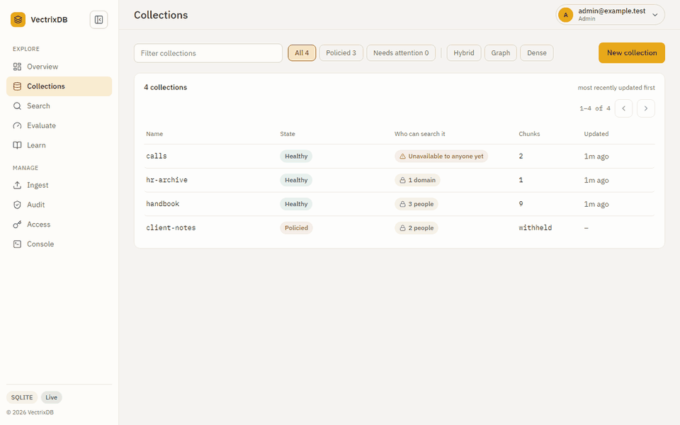
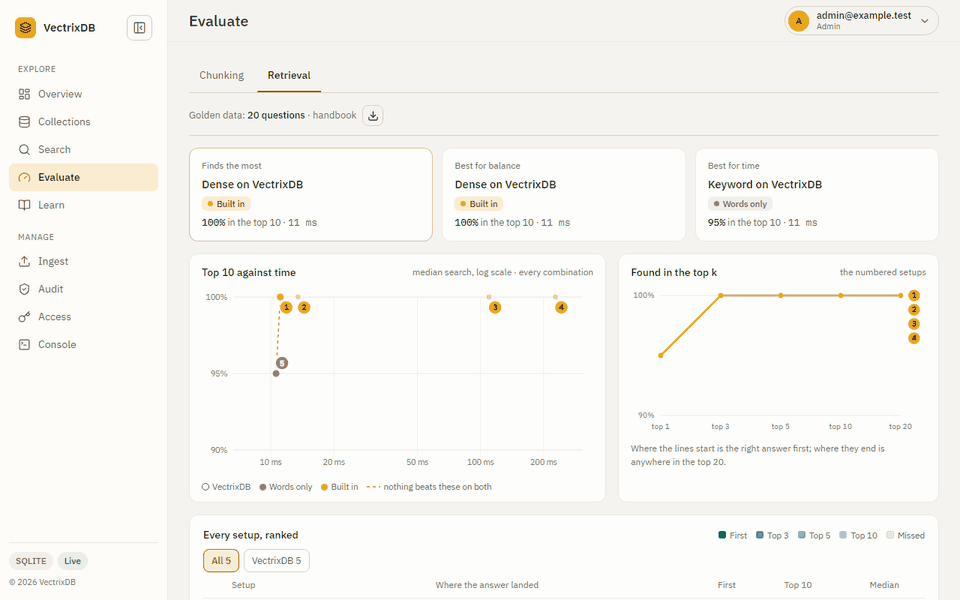
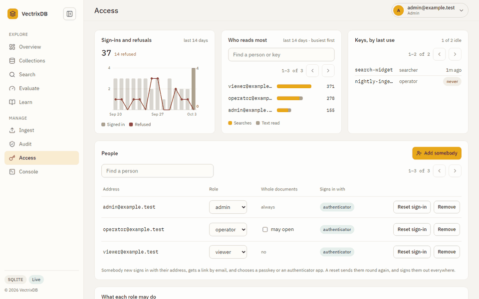
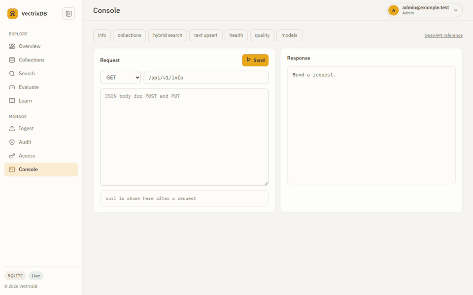

---
hide:
  - navigation
  - toc
---

<div class="vx-hero" markdown>

# The vector database that works <em>with no network and no accounts</em>

<p class="lead">Embedded ONNX models, GraphRAG, and eight storage backends.
Nothing to sign up for, no API key, no service to run. <code>pip install</code> and search.</p>

<div class="vx-actions" markdown>
[Get started](tutorial/getting-started.md){ .md-button .md-button--primary }
[Use the dashboard](how-to/dashboard.md){ .md-button }
[GitHub](https://github.com/knowusuboaky/VectrixDB){ .md-button }
</div>


<span class="vx-caption">A question goes in, and every result says how well it matched and what found it: meaning, keywords, or both.</span>

</div>

```bash
pip install vectrixdb
```

```python
from vectrixdb import Vectrix

db = Vectrix("my_docs")
db.add(["Python is great", "JavaScript powers the web", "Rust is fast"])

results = db.search("programming")
print(results.top.text)
```

That is the whole setup. The embedding model ships in the package, so the first
search works offline on a machine that has never seen an API key.

## See it work

`pip install "vectrixdb[api]"` and `vectrixdb serve` give the same collections
a REST API and a dashboard. These are the real pages and the real containers,
filmed by the scripts that keep the pictures current.

<div class="vx-tours" markdown>

<div class="vx-tour" markdown>

### Ingest
A PDF goes in. The server says what it read: pages, chunks, and a citation for each.
</div>

<div class="vx-tour" markdown>

### Collections
Every collection with its state, mode and model, and what it holds, tab by tab.
</div>

<div class="vx-tour" markdown>

### Evaluate
Every setup ranked on your own questions, and three picks: most found, best balance, fastest.
</div>

<div class="vx-tour" markdown>

### Access
People who sign in as themselves, roles, and a record of who read what.
</div>

<div class="vx-tour" markdown>

### Console
Build a request, send it, and copy the curl that does the same.
</div>

<div class="vx-tour" markdown>

### The whole walk
Overview, Collections, the evaluation run with its picks, and Audit.
</div>

<div class="vx-tour" markdown>

### Containers
Compose starts the server, the extraction service and Jaeger. A scan goes in and a search finds it.
</div>

<div class="vx-tour" markdown>

### Traces
One trace from the server into the extraction service: counts and timings, never the text.
</div>

</div>

## Where to go next

<div class="grid cards" markdown>

- **[Getting started](tutorial/getting-started.md)**

    Learn the library by building something small, end to end.

- **[How-to guides](how-to/handle-errors.md)**

    Recipes for specific jobs: error handling, storage backends, the REST API.

- **[Reference](reference/easy.md)**

    Signatures and behaviour, generated from the source.

- **[Explanation](explanation/why-vectrixdb.md)**

    Why the search modes differ, and where the pure-Python index runs out.

- **[Conversation memory](how-to/conversation-memory.md)**

    Turns, pinned facts and a context block sized to a token budget.

- **[MCP server](how-to/mcp-server.md)**

    Give an assistant a collection to search and remember into.

- **[Use the dashboard](how-to/dashboard.md)**

    Every page of the server's dashboard, with pictures, and who sees which.

- **[Deploy the server](how-to/deploy.md)**

    One settings file, checked before a start, read by every command.

- **[Measure retrieval](how-to/measure-retrieval.md)**

    Golden questions written from your own documents, and checked against them.

- **[What it does not do](explanation/limits.md)**

    Every limit in one place, with what to do about each.

</div>

## What is in the box

| | |
|---|---|
| **Search modes** | Dense, Hybrid, Ultimate, Graph (GraphRAG) |
| **Storage** | Memory, SQLite, Lakebase, Delta Lake, Cosmos DB, Azure AI Search, OpenSearch, Aurora PostgreSQL |
| **Models** | Bundled ONNX, or bring your own from HuggingFace |
| **Readers** | PDF, Word, Excel, Markdown, scans by sight, speech, video |
| **Memory** | Conversation turns, pinned facts, recency and feedback weighting |
| **Extras** | Document index with chunking, dashboard, REST API, CLI, MCP server |

## Install what you need

The core install is deliberately small: vector search, and nothing else.

```bash
pip install vectrixdb              # core
pip install vectrixdb[api]         # + REST API and dashboard
pip install vectrixdb[signin]      # + people signing in: single sign-on, passkeys, codes
pip install vectrixdb[mcp]         # + MCP server for assistants
pip install vectrixdb[documents]   # + PDF, Word and Excel readers
pip install vectrixdb[extract]     # + every local reader: documents, OCR, speech, video
pip install vectrixdb[aws]         # + OpenSearch and Aurora
pip install vectrixdb[azure]       # + Azure AI Search and Cosmos DB
pip install vectrixdb[databricks]  # + Lakebase and Delta Lake
pip install vectrixdb[nlp]         # + spaCy for GraphRAG entity extraction
pip install vectrixdb[all]         # every backend, model and server extra; not extract or nlp
```
